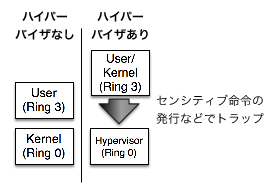
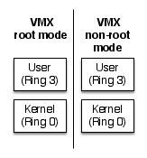
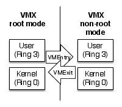
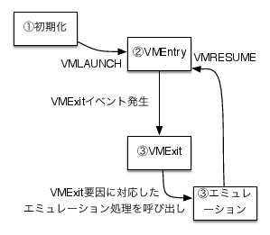

---
authors:
- 'Takuya ASADA syuu@dokukino.com'
title: |
    ハイパーバイザの作り方～ちゃんと理解する仮想化技術～ 第１回
    x86アーキテクチャにおける仮想化の歴史とIntel VT-x
...

はじめに
========

初めまして、浅田拓也（@syuu1228）です。本号より「ハイパーバイザの作り方」と題して、ハイパーバイザの内部の実装やその土台となるハードウェア側の仮想化支援技術の詳細について解説を行なっていきます。よろしくお付き合いお願い致します。

x86アーキテクチャにおける仮想化の歴史と仮想化手法
=================================================

近年、x86アーキテクチャのコンピュータの性能が劇的に向上したことにより、デスクトップ用途だけでなくサーバ用途にも積極的に用いられるようになりました。

さらに、サーバとしてもユースケースによってはハードウェア性能に余裕が出てきたことにより、ここに仮想化を導入して複数のサーバインスタンスを1つの物理サーバで実行することが現実的な選択肢になってきました。

しかしながら、x86アーキテクチャは仮想化が困難なアーキテクチャとして知られていました。Formal
Requirements for Virtualizable Third Generation
Architectures@Popekという今から40年ほど前に発表された論文で、ハイパーバイザを実装するのに必要な命令セットアーキテクチャ上の要件として「PopekとGoldbergの仮想化要件」というものが定義されています。

内容を簡単に説明すると、システム資源の構成を変えようとする命令やシステム資源の構成に動作が依存している命令（「センシティブな命令」と呼ばれる）がユーザモードで実行されるときには、これがトラップされなければならない、ということを言っています（図[fig1]）。

 [fig1]

なぜかということをもう少し説明します。この論文では、ハイパーバイザの構成法として、ゲストマシン上のユーザランドプログラム・カーネルプログラムをユーザモードで動作させ、センシティブ命令をトラップしてハイパーバイザで適切なエミュレーション処理を行うことにより、ゲストマシンへ仮想的なコンピュータの状態を提供することを意図しています。

しかし、x86アーキテクチャではユーザ権限で実行可能である（＝トラップされない）にもかかわらず、センシティブな命令というものが複数あります。このため、このアーキテクチャ上でハイパーバイザを実装するには効率性をある程度犠牲にしてセンシティブな命令の実行を回避し、適切な処理に置き換える必要がありました[^1]。

では、どのような方法が取られたのでしょうか。

VMwareでの実装
==============

VMwareでは、Binary
Translationと呼ばれる手法が採られました。これは、ゲストマシンで実行したい命令のうち、実行して問題ないもの（ユーザモードの命令のうち、センシティブではない命令）は直接CPUで実行し、実行されては問題がある命令は実行される前にハイパーバイザが動的に書き換えていく、というしくみを採っています。

これによって、OSをハイパーバイザ向けに変更することなく、ある程度高速に実行できるようになりました（オーバーヘッドはあるのですが、ゲストマシンで実行されるすべてての命令をエミュレーションする方式に比べるとかなり速くなりました）。

Xenでの実装
===========

一方、Xenでは準仮想化と呼ばれる手法が採られました。これは、ハイパーバイザ向けに書き換えた専用のゲストOSを用意することにより、ゲスト実行の効率を上げようという考え方です。Xen向けに書き換えられたゲストOSではハイパーバイザの介在が必要な処理で「ハイパーバイザコール」を発行し、処理をハイパーバイザへ依頼します。

前述の動的に書き換えるという手法に対して、この手法では事前にOSを書き換えているため、静的に書き換えている、とも言えます。これにより、OSを修正するというコストがかかる代わりに、仮想化環境でより実機に近い性能が得られるようになりました。

仮想化技術の普及
================

これらの技術を用いて、VMware社は2001年にサーバ向けのハイパーバイザであるVMware
GSX/ESXを、ケンブリッジ大学のComputer Laboratoryは2003年にXen
1.0をリリースしています。これらのプロダクトの出現により、PCサーバでの仮想化が普及し始めました。ここで、Intelはそもそもx86を「仮想化可能」なアーキテクチャへ拡張しようという取り組みを開始しました。Intel
Developers ForumFall 2003でVanderpool
Technology（VT）として紹介され（その後VT-xと改名し）、2005年に最初のVT-x対応Pentium
4が出荷されました[^2]。

これにより、前述のような工夫を行う場合に比べて、より単純なハイパーバイザ実装で仮想化が実現できるようになりました。しかもより実機に近い性能が得られるように発展しました[^3]。VT-xがリリースされたことにより、上述のソフトウェアによる仮想化サポートの手法を採っていた初期のVT-xではVT-xよりも仮想化方式のほうが性能が高いケースがあったようですが、そのあとのCPUの改良によりVT-xのパフォーマンスや機能が向上したため、今ではVT-xを使用することが多くなっています。

また、ごくローエンドのPCを除き、ラップトップPCをも含めほぼすべてのレンジのPCにVT-xが載ることとなり、サーバマシンだけでなくデスクトップ用途でもVT-xの恩恵を受けることができるようになりました。

さらに、最初からハードウェア仮想化支援機能をハイパーバイザ実装に用いることを前提に開発されたLinux
KVMなどの新しいハイパーバイザも登場してきました。

Intel VT-x の概要
=================

それではこの、PCの仮想化に必須の技術となっているVT-xの中身について見て行きましょう。VT-xでは、既存のソフトウェアとの互換性を保ちつつ「仮想化可能」にするため、x86アーキテクチャにすでに存在するプログラムの権限管理に用いられるRingプロテクションのしくみとは別に、ハイパーバイザ向けのプロテクションモデルを導入しています。このために「ハイパーバイザのモード」と「ゲストマシンのモード」が追加されました。この「ハイパーバイザのモード」をVMX
Root Mode、「ゲストマシンのモード」をVMX non Root
Modeと呼びます（図[fig2]）。

 [fig2]

先ほど紹介したVMwareやXenのアプローチとは異なり、VT-xではゲストOSにVMX
non Root Mode上でセンシティブな命令をそのまま実行させます。
実行された命令がセンシティブな命令だったときは、VMX non Root
Modeでのプログラムの実行が中断されてVMX Root
Modeへモードが遷移し、ハイパーバイザがゲストマシンで実行された命令に対して適切な処理を行う、というしくみになっています。

つまり、従来「PopekとGoldbergの仮想化要件」を満たさない命令（＝そのままCPUで実行したときにトラップできないセンシティブ命令）が存在していたx86アーキテクチャに上述の2モードを導入することにより、VMX
non Root Mode上で実行されたセンシティブな命令をVMX Root
Modeでトラップ可能にして「PopekとGoldbergの仮想化要件」を満たすようアーキテクチャを拡張しています。

このとき、VMX Root ModeからVMX non
RootModeへ切り替えることをVMEntry、VMX non RootModeが中断されVMX Root
Modeへ戻ってくることをVMExitと呼びます（図[fig3]）。

 [fig3]

センシティブな命令以外でも、一般的なハイパーバイザではCPU外部のハードウェアから割り込みがかかったときにも、ハイパーバイザ側で割り込みをハンドルするためにVMX
non Root
Modeを中断してVMExitする必要が生じます。ですが、どのようなイベントが発生したときにVMExitを起こすべきなのかは、ハイパーバイザの設計に依存するところがあります。

このため、VT-xではあらかじめ用意されたイベントの中から「これはVMExitする、これはVMExitしない」というようにハイパーバイザ側でコンフィギュレーション可能になっています。このコンフィギュレーション情報はVMCSと呼ばれ、ハイパーバイザのメモリ空間上にゲストマシンごとに別々に用意する必要があります。

ハイパーバイザはVMCS（Virtual Machine Control
Structure）に対してゲストマシンの設定を行い、VMEntry前にCPUへアドレスを通知し、CPUはVMCSの値に基づいてゲストマシンの制御を行います。また、コンフィギュレーション情報だけでなく、VMExitされたときのゲストマシンのレジスタ値やVMExit要因などゲストマシンのステート情報もCPUによってVMCSへ記録されます。

VT-xを用いたハイパーバイザのライフサイクル
==========================================

それでは、これまでに説明したIntel
VT-xを用いたハイパーバイザ上でゲストが実行される一連のサイクルをより詳しく見ていきましょう。

(1)「VT-xを有効化」 {#vt-xを有効化 .unnumbered}
-------------------

VT-xの機能を使うには、まずVT-xを有効にする必要があります。VT-xを有効にするには、CR4レジスタのVMXEビットに１をセットした上でVMXON命令を発行します。この作業はRing0（特権モード）で行われる必要があります。これは、以降の作業についても基本的に同様です（ですので、ユーザモードのプログラムでVT-xを用いたハイパーバイザを実装することはできません）。

また、厳密にはプロテクトモードでなければならない、A20モードが無効化されていなければならないなどの制約があり、VT-xを有効化するための条件を満たしていない場合はVMXON命令発行時に例外が発生します。

(2)「VMCSを初期化、ゲストマシンの設定をロード」 {#vmcsを初期化ゲストマシンの設定をロード .unnumbered}
-----------------------------------------------

ゲストマシンを実行する為には、前述したVMCSがゲストマシンのCPU((通常、仮想CPU(vCPU)と呼ばれます))1つに対して1つ用意され、適切に初期化されていなければなりません。このVMCSはメインメモリ上の4KBの領域でページ境界（4KB）でアラインされている必要があります。メモリ上の領域なので直接読み書きできるのですが、VMCSの内部構造は公開しておらず、専用の命令を介して間接的にアクセスすることになっています。

ここでは、VMCSのアドレスをCPUへ設定する為にVMPTRLD命令を実行し、続いてVMCS上のフィールドへ書き込みを行う為にVMWRITE命令を実行します。ここで初期化する情報としては、ゲストレジスタの初期値やVMX
non-root modeの挙動の制御などがあります。
詳しくは次号でこの「VMCSの構造」を解説しますので、しばしお待ち（ご期待）ください。

(3)「CPUにVMCSをセット」 {#cpuにvmcsをセット .unnumbered}
------------------------

(2)ですでに設定されていれば必要ありませんが、(4)のVMEntryに先立ってVMPTRLD命令でVMCSのアドレスをCPUへ設定する必要があります。

(4)「ハイパーバイザのレジスタを退避」 {#ハイパーバイザのレジスタを退避 .unnumbered}
-------------------------------------

VMEntryに先立って、VMExit時にハイパーバイザの状態を復元できるようにするため、レジスタの値を退避しておく必要があります。
一部のレジスタはVMExit時に自動的に復帰するために、VMCSへ退避します。このための領域が“Host
state
area”としてVMCSに定義されており、VMWRITE命令で書き込みます。それ以外のレジスタはPUSHA、PUSHF命令などで手動で退避します。

(5)「ゲストのレジスタを復帰」 {#ゲストのレジスタを復帰 .unnumbered}
-----------------------------

ゲストのレジスタも同様、一部のレジスタはVMEntry時に自動的に復帰されます。
この為の領域としてVMCSに“Guest state area”が定義されています。
ただし、これも一部のレジスタのみが対象であるため、それ以外のレジスタはVMCSとは別にレジスタを保存するためのメモリ領域を確保しておき、ここからMOV命令などを用い手動で復帰します。

(6)「VMX non Root ModeへVMEntry」 {#vmx-non-root-modeへvmentry .unnumbered}
---------------------------------

CPUのモードを切り替えて(3)で指定されたVMCSが指すゲストマシンを実行します。この時、(2)でVMCSを初期化してから初めてのVMEntryの時のみVMLAUNCH命令でVMEntryを行います。以降のVMEntryはVMRESUME命令で行います。

(7)「ゲストマシン実行」 {#ゲストマシン実行 .unnumbered}
-----------------------

CPUは何らかの理由によってVMExitされるまでの間、VMX non Root
Modeでゲストマシンを実行します。

(8)「何らかのトラップ要因が発生、VMExitする」 {#何らかのトラップ要因が発生vmexitする .unnumbered}
---------------------------------------------

センシティブ命令の実行や外部割り込みなどの要因によりVMExitが発生すると、CPUはVMCの“VM-exit
information fields”へVMExit要因を書き込み、“Guest state
area”へゲストのレジスタを退避し、“Host state area”
からホストのレジスタを復帰し、CPUのモードをVMX Root modeへ切り替えます。

(9)「ゲストのレジスタを退避」 {#ゲストのレジスタを退避 .unnumbered}
-----------------------------

VMExitで退避対象になっていないレジスタを(5)で使用しているメモリ領域へMOV命令などを用いて手動で退避します。

(10)「ハイパーバイザのレジスタを復帰」 {#ハイパーバイザのレジスタを復帰 .unnumbered}
--------------------------------------

VMExitで復帰対象になっていないレジスタを(4)で退避された領域からPOPA、POPF命令などを用いて手動で復帰します。

(11)「VMExit要因を調べ、要因に合わせたエミュレーション処理を行う」 {#vmexit要因を調べ要因に合わせたエミュレーション処理を行う .unnumbered}
------------------------------------------------------------------

VMCSの“VM-exit information
fields”に書き込まれたVMExit要因を調べ、要因に合わせたエミュレーション処理を行います。特権レジスタへの読み書きであればレジスタの挙動をエミュレーションする必要がありますし、ハードウェアへのI/O命令であれば対象のハードウェアの挙動をエミュレーションする必要があります。
どのようなイベントでVMExitを発生させることができるのかについては@SDMを参照してください。

また、この時、次回のVMEntryが異なるCPUから実行される可能性がある場合は、必ずVMCLEAR命令を実行してCPUからVMCSのアドレスをクリアしなければなりません。これは、VMCLEAR命令を実行するまではVMCSのデータがメモリへライトバックされていることが保証されないためです。

(12)「(3)に戻る」 {#に戻る .unnumbered}
-----------------

以上のように、VMX non Root
Modeでのゲストマシン実行とVMExit要因ごとのエミュレーション処理を繰り返すことにより、仮想化環境が実現されます（図[fig4]）。

 [fig4]

まとめ
======

いかがでしたでしょうか。今回は初回ということで、まずx86アーキテクチャにおける仮想化の歴史を振り返り、次にIntel
VT-xによるハードウェア仮想化支援機構の概要について見てきました。

お気づきの方もいらっしゃると思いますが、今回のIntel
VT-xの解説では、主に「CPUの仮想化」についてのみ解説を行なっています。実際にハイパーバイザを動かすには、大きな括りとしてもう2つ、「メモリの仮想化」と「I/Oの仮想化」を考えなければなりません。

ですので次回は、今回紹介しきれなかった「CPUの仮想化」の詳細と「メモリの仮想化」について解説していこうと思います。

ライセンス
==========

Copyright (c) 2014 Takuya ASADA. 全ての原稿データ は
クリエイティブ・コモンズ 表示 - 継承 4.0 国際
ライセンスの下に提供されています。

4 Formal Requirements for Virtualizable Third Generation
Architectures
<http://www.dc.uba.ar/materias/so/2010/verano/descargas/articulos/VM-requirements.pdf>
Intel(R) 64 and IA-32 Architectures Software Developer Manuals
<http://www.intel.com/content/www/us/en/processors/architectures-software-developer-manuals.html/>

[^1]: 効率を気にしなければ、ゲストマシン上で実行されるすべての命令をエミュレートすればどのような命令セットでも問題なくゲストマシンを実行できます。これは「エミュレータ」と呼ばれ、異なるアーキテクチャのコンピュータをゲストとして実行するのには必要ですが、同じアーキテクチャのコンピュータをゲストとして実行する場合には効率が非常に悪いです。x86アーキテクチャのエミュレータとしてQEMUが有名ですが、QEMUとVT-xを用いるハイパーバイザのLinuxKVMの実行速度を比較してみてください。かなり差があるはずです。

[^2]: その後、AMDも同様の機能をAMD-Vとして出してきており、そのような技術の総称としてこれらは「ハードウェア仮想化支援機能」と呼ばれています。本記事では、解説がややこしくなることを避けるために、敢えて「Intel
    VT」に絞って解説を行いますが、基本的にAMD-Vも同じようなしくみを提供しています。

[^3]: とくにXenの場合は、Xenサポートを実装したWindowsがリリースされなかったため、VTーxに対応して未書き換えなOSを動作可能にさせる意義がありました。
