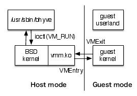

# 第10回 Intel VT-xを用いたハイパーバイザの実装

##     その 6 「ユーザランドでの I/O エミュレーション」


## はじめに

前回は、VMX non root modeからvmm.koへVMExitしてきたときの処理を解説しました。今回はI/O命令によるVMExitを受けて行われるユーザランドでのエミュレーション処理を解説します。

## 解説対象のソースコードについて

本連載では、FreeBSD-CURRENTに実装されているBHyVeのソースコードを解説しています。このソースコードは、FreeBSDのSubversionリポジトリから取得できます。リビジョンはr245673を用いています。
お手持ちのPCにSubversionをインストールし、次のようなコマンドでソースコードを取得してください。
svn co -r245673 svn://svn.freebsd.org/base/head src

## /usr/sbin/bhyveによる仮想CPUの実行処理のおさらい

 /usr/sbin/bhyveは仮想CPUの数だけスレッドを起動し、それぞれのスレッドが/dev/vmm/${name}に対してVM_RUN ioctlを発行します(図[fig1])。vmm.koはioctlを受けてCPUをVMX non root modeへ切り替えゲストOSを実行します(VMEntry)。



VMX non root modeでハイパーバイザの介入が必要な何らかのイベントが発生すると制御がvmm.koへ戻され、イベントがトラップされます(VMExit)。
イベントの種類が/usr/sbin/bhyveでハンドルされる必要のあるものだった場合、ioctlはリターンされ、制御が/usr/sbin/bhyveへ移ります。/usr/sbin/bhyveはイベントの種類やレジスタの値などを参照し、デバイスエミュレーションなどの処理を行います。
今回は、この/usr/sbin/bhyveでのデバイスエミュレーション処理の部分を見ていきます。

## /usr/sbin/bhyveでのI/O 命令ハンドリング

前回の記事に引き続き、I/O命令でVMExitした場合について見ていきます。VMExitに関する情報はVM_RUN ioctlの引数であるstruct vm_runのvm_exitメンバ(struct vm_exit)に書き込まれ、ioctl return時にユーザランドへコピーされます。/usr/sbin/bhyveはこれを受け取り、vmexit->exitcodeを参照してどのようなVMExit要因だったか判定し、VMExit要因ごとの処理を呼び出します。I/O命令でVMExitした場合のexitcodeはVM_EXIT_INOUTです。
VM_EXIT_INOUTの場合、I/Oの命令のエミュレーションに必要な情報(ポート番号、アクセス幅、書き込み値(読み込み時は不要)、I/O方向(in/out))がstruct vm_exitを介してvmm.koから渡されます。
/usr/sbin/bhyveはこの値をI/Oポートエミュレーションハンドラに渡し、 I/Oポート番号からどのデバイスへのアクセスなのかを判定し、デバイスのハンドラを呼び出します。
ハンドラの実行が終わったら、/usr/sbin/bhyveはふたたびVM_RUN ioctlを発行して、ゲストマシンの実行を再開します。
では、以上のことを踏まえてソースコードの詳細を見ていきましょう。リスト1、リスト2、リスト3、リスト4にソースコードを示します。キャプションの丸数字で読む順番を示しています。

### vmmapi.c と bhyverun.c の解説

libvmmapiはvmm.koへのioctl・sysctlを抽象化したライブラリで、/usr/sbin/bhyve・/usr/sbin/bhyvectlはこれを呼び出すことによりvmm.koへアクセスします(リスト1)。
リスト2 bhyverun.cは/usr/sbin/bhyveの中心になるコードです。

### リスト 1   lib/libvmmapi/vmmapi.c
```
▼リスト 2   usr.sbin/bhyve/bhyverun.c
```


### inout.c

inout.cはI/O命令エミュレーションを行うコードです。実際にはI/Oポートごとの各デバイスエミュレータのハンドラを管理する役割を担っており、要求を受けるとデバイスエミュレータのハンドラを呼び出します。呼び出されたハンドラが実際のエミュレーション処理を行います。

### リスト 3   usr.sbin/bhyve/inout.c
```

  consport.c
```

consport.cはBHyVe専用の準仮想化コンソールドライバです。現在はUART (Universal Asynchronous Receiver Transmitter)エミュレータが導入されたので必ずしも使う必要がなくなったのですが、デバイスエミュレータとしては最も単純な構造をしているので、デバイスエミュレータの例として取り上げました。

### リスト 4   usr.sbin/bhyve/inout.c
```

```


## まとめ

I/O命令によるVMExitを受けて行われるユーザランドでのエミュレーション処理について、ソースコードを解説しました。今回までで、ハイパーバイザの実行サイクルに関するソースコードの解説を一通り行ったので、次回はvirtioのしくみについて見ていきます。
ライセンス
==========

Copyright (c) 2014 Takuya ASADA. 全ての原稿データ は
クリエイティブ・コモンズ 表示 - 継承 4.0 国際
ライセンスの下に提供されています。
