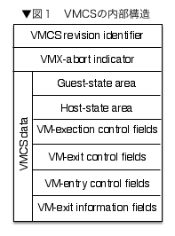
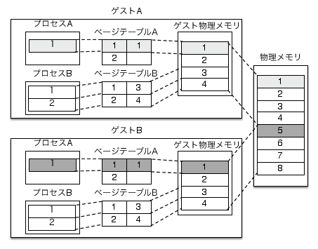
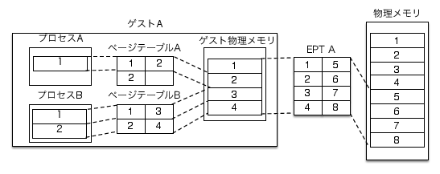

---
authors:
- 'Takuya ASADA syuu@dokukino.com'
title: |
    ハイパーバイザの作り方～ちゃんと理解する仮想化技術～ 第２回 Intel
    VT-xの概要とメモリ仮想化
...

VMCSの構造
==========

それでは、前回のハイパーバイザのライフサイクルの説明でも度々紹介したハイパーバイザ側のコンフィグレーション情報であるVMCS（Virtual
Machine Control Structure）の内部構造（図[fig1]）を以下に説明します。

 [fig1]

VMCS revision identifier {#vmcs-revision-identifier .unnumbered}
------------------------

VMCS のデータフォーマットのリビジョン番号。VT-x
が拡張され、古いCPUと新しいCPUではVMCS
のフォーマットが異なる可能性があるため、バージョンチェックのためリビジョンが書き込まれる。ハイパーバイザでサスペンド／レジュームやマイグレーションを実装する時に異なるIntel
CPU間でVMCSをセーブ／ロードした時に不整合が発生するのを防ぐことを意図している

VMCS-abort indicator {#vmcs-abort-indicator .unnumbered}
--------------------

VMExit 中にエラーが発生し、正常にVMExit 要因などのデータがVMCS
へ書き込めなかった場合、エラーコードがここに書き込まれる。「VMExit
が失敗した場合」なので、正常に動作している限りは使われない

VMCS data {#vmcs-data .unnumbered}
---------

VMCS の本体部分で、通常はこの領域のいずれかのフィールドを読み書きする

Guest-state area {#guest-state-area .unnumbered}
----------------

VMExit 時にゲストのレジスタを退避し、VMEntry
時に復帰するための領域です。次のレジスタが保存の対象：

CR0, CR3, CR4, DR7, RSP, RIP, RFLAGS, CS, SS, DS, ES, FS, GS, LDTR, TR,
GDTR, SMBASE

また、以下のMSRレジスタが保存の対象：

IA32\_DEBUGCTL, IA32\_SYSENTER\_CS, IA32\_SYSENTER\_ESP,
IA32\_SYSENTER\_EIP,IA32\_PERF\_GLOBAL\_CTRL, IA32\_PAT, IA32\_EFER

さらに、レジスタ以外のステートとして、仮想CPU
の状態・各セグメントの状態や属性・割り込みブロック状態の有無・VMX
プリエンプションタイマのカウンタ・EPT のPTE
アドレス等の情報も記録されている。

ここで保存の対象になっていないレジスタについてはハイパーバイザが退避と復帰を行う必要がある

Host-state area {#host-state-area .unnumbered}
---------------

VMEntry 時にハイパーバイザのレジスタを退避し、VMExit
時に復帰するための領域。次のレジスタが 保存の対象になっている：

CR0, CR3, CR4, RSP, RIP, CS, SS, DS, ES, FS, GS, LDTR, TR, GDTR

また、以下のMSRレジスタが保存の対象になっている：

IA32\_SYSENTER\_CS, IA32\_SYSENTER\_ESP, IA32\_SYSENTER\_EIP,
IA32\_PERF\_GLOBAL\_CTRL,IA32\_PAT, IA32\_EFER

ここで保存の対象になっていないレジスタについては、ハイパーバイザが退避と復帰を行う必要がある

VM-execution control fields {#vm-execution-control-fields .unnumbered}
---------------------------

ゲストマシン実行時のCPU
の挙動を設定するエリア。どのようなイベントでVMExit
するかという情報はここに含まれている。各種のVMExit
要因のオン／オフフラグの他、EPT（メモリ仮想化支援）のオン／オフフラグ、EPT
のアドレス、仮想Local APIC の設定、VPID のアドレスなどが含まれる

VM-exit control fields {#vm-exit-control-fields .unnumbered}
----------------------

VMExit 時のCPU
の挙動を設定するエリア。外部割り込み要因でVMExitしたときのCPUの挙動や、いくつかのMSR
を退避・復帰機能のオン／オフフラグ、ハイパーバイザの64モードのオン／オフフラグなどが含まれる

VM-entry control fields {#vm-entry-control-fields .unnumbered}
-----------------------

VMEntry 時のCPU
の挙動を設定する。ゲストマシンへの割り込み挿入のフィールドやいくつかのMSR
の復帰機能のオン／オフフラグなど、ゲストの64bitモードのオン／オフフラグなどが含まれる

VM-exit information fields {#vm-exit-information-fields .unnumbered}
--------------------------

VMExit 時のexit 要因がここに書き込まれる

VMExit要因
==========

VT-xではリスト1のような要因によるVMExitを発生させることができます。これらの要因でVMExitを発生させるかどうかはVMCS上の「VM-execution
control fields」で設定し、発生した場合VMCS上の「VM-exit information
fields」に書き込まれます。

リスト１　VMExit要因 {#リストvmexit要因 .unnumbered}
--------------------

-   例外かNMI割り込みの発生

-   外部割り込みの発生

-   トリプルフォールト

-   INITシグナルの受信

-   SIPIの受信

-   SMIの受信

-   内部割り込みの発生

-   タスクスイッチ

-   CPUID命令の実行

-   Intel SMX 関連の命令の実行

-   HLT命令の実行

-   キャッシュ関連の命令の実行（INVD, WBINVD）

-   TLB関連の命令の実行（HNVLPG, INVPCID）

-   I/O関連の命令の実行（INB,OUTBなど）

-   パフォーマンスモニタリングカウンタ関連の命令の実行（RDPMC）

-   タイムスタンプカウンタ関連の命令の実行（RDTSC）

-   SMM関連の命令の実行（RSM）

-   VT-x拡張命令セットの実行

-   コントロールレジスタへのアクセス

-   拡張コントロールレジスタへのアクセス

-   デバッグレジスタへのアクセス

-   MSRへのアクセス

-   MONITOR/MWAIT 命令の実行

-   PAUSE 命令の実行

-   APICレジスタへのアクセス

-   GDTR、IDTR、LDTR、TRレジスタへのアクセス

-   VMXプリエンプションタイマのエクスパイヤ

-   RDRAND命令の実行

VT-x 拡張命令セット
===================

ハイパーバイザからVT-xの機能へアクセスするために、次のような命令が追加されています（ただし、VMCALLとVMFUNCについてはゲストマシンから呼ばれることが想定されています）。各命令のさらに詳しい説明については@SDMを参照してください。

VMCSメンテンナンス命令 {#vmcsメンテンナンス命令 .unnumbered}
----------------------

VMCS内のデータは普通のメモリアクセス命令で読み書きするのではなく、VMREAD/VMWRITEを経由する必要があります。ゲストマシン起動時の手順は、VMPTRLDでVMCSのアドレスを設定、VMCLEARで初期化、VMWRITEでフィールドへ初期値を書き込んでからVMEntryとなります。

VT-x管理命令 {#vt-x管理命令 .unnumbered}
------------

ハイパーバイザ上で一連のVT-x拡張命令セットを利用するには、まずVMXONを実行する必要があります。VMX
non Root
ModeへVMEntryするには、初めてVMEntryするときだけVMLAUNCH、以降VMExitから復帰するときはVMRESUMEとなります。

ハイパーコール命令 {#ハイパーコール命令 .unnumbered}
------------------

ゲストマシンからハイパーバイザを呼び出して何らかの処理を依頼するための命令です。準仮想化を実現するために使われることがあります。EPT操作命令メモリアクセスの仮想化支援（EPT）が有効なハイパーバイザで使われる命令です。EPTについては後述します。

ページングとメモリの仮想化 {#ページングとメモリの仮想化 .unnumbered}
--------------------------

マルチタスクをサポートする近代的なOSでは、プロセスごとに独立したメモリ空間を持ち、あるプロセスは別のプロセスのメモリ領域へアクセスできないようになっています。

これを実現するために、CPUに「仮想メモリ」をサポートする機構（MMU）が搭載されています((別の方式としてセグメント方式というものがあり、x86アーキテクチャはこの方式からページング方式へ移行してきたという歴史的事情があるため、今でもセグメント方式をサポートしています。))。

仮想メモリの実現方法として、現在では一般的に「ページング方式」がとられています。この方式では、プロセスごとの仮想メモリ空間を固定長（x86アーキテクチャでは一般的に4KB）に区切り、仮想ページと物理ページの割り当て情報を「ページテーブル」と呼ばれるメモリ上の表に記録します（図[fig2]）。

 [fig2]

CPUからメモリへのアクセスがあった時、MMUはページテーブルを用いて仮想アドレスを物理アドレスへ変換し、適切な物理メモリアドレスへのアクセスを可能にします。

ページテーブル上の各ページに対するエントリには対応する物理ページの情報以外にも、アクセス権（読み／書き／実行）のような属性情報が存在します。

これによって特定のメモリ範囲に対してアクセス制御を行うようなことができます。

また、アクセスの少ない物理ページをディスクへ書き出しページテーブル上の割り当て情報を解除（ページアウト）します。そして後にアクセスが起こったときにディスクから読み込んでページテーブル上の割り当て情報を再設定（ページイン）することで、物理メモリ容量よりも大きな仮想メモリを扱うことができるようになります。

仮想化されたシステムにおいて、CPU上でそのままゲストOSを実行する時、このページング機構を仮想化する必要が生じます。これは、ゲストOS上のプロセスに割り当てられた仮想ページの参照先である物理ページのアドレスが指しているのはハイパーバイザがゲスト環境へ割り付けたメモリ領域内のアドレスであり、ハイパーバイザが管理する物理メモリ空間上のアドレスではないからです。

たとえば、仮想マシンAへ1から4まで、仮想マシンBへ5から8までの物理ページを割り当てたとします。それぞれの仮想マシン上の物理ページ1へアクセスが行われる時、実際には仮想マシンAからであれば物理ページ1へ、仮想マシンBからであれば物理ページ5へアクセスが行われなければなりません（図[fig3]）。

 [fig3]

この問題を解決するメモリ仮想化の手法として、ソフトウェアによる「シャドーページング」、ハードウェアによる「EPT」の2つを紹介します。

x86アーキテクチャにおけるページング機構
=======================================

まず、x86アーキテクチャにおけるページング機構について、簡単におさらいしましょう。x86アーキテクチャでは1ページのサイズは4KBであるため、32bitモードでのページ総数は1,048,576ページとなります。このページテーブルを単純な2次元の表として表すと消費メモリ量が大きくなってしまいます。

そこで、x86アーキテクチャではページディレクトリテーブルという概念を導入しました。これにより、少ないサイズでページテーブルを表現しています。1
つのページテーブルは1024エントリとし、1つのページテーブルに4MBの仮想メモリ空間の情報を持たせます。

ページディレクトリテーブルは、このページテーブルのアドレス情報を格納します。ページディレクトリテーブルは1024
エントリあり、4GBの仮想メモリ空間全体を表現しています（図[fig4]）。

[fig4]

64bitモードの場合は8バイトのページテーブルエントリがテーブル当たり512エントリとなり、さらにページディレクトリポインタテーブルとページマップレベル4テーブルの2段が追加されて256TBの仮想メモリ空間をサポートしています[^1]（図[fig5]）。

 [fig5]

複数段にするだけではページテーブルの総エントリ数は変わりません。しかし、未使用の仮想メモリ空間も発生するため、必要な仮想メモリ空間に対してのみページテーブルを作成すれば、その分消費メモリを抑えることができます。

ページディレクトリテーブルのアドレスをCPUにセットするためのレジスタとしてCR3レジスタが用意されています。MMUは仮想メモリ空間へのアクセスに対してCR3レジスタに書かれたページディレクトリテーブルのアドレスへアクセスして探索を行います。探索を行う時、仮想アドレスの先頭10ビットをページディレクトリテーブルへのオフセットとしてページテーブルを指すエントリを探索します。

ページテーブルでは仮想アドレスの11～20ビットをオフセットとして物理ページを指すエントリを探索します。見つかった物理ページのアドレスに対して仮想アドレスの残り12ビットの値を足したアドレスが、CPUがアクセスしようとしている物理アドレスとなります。

ページディレクトリテーブル／ページテーブルの各エントリにはページテーブル／物理ページのアドレスだけでなく、いくつかの属性情報が含まれます。

次にその詳細を示します。

-   プレゼントビット……1なら物理メモリ上に存在、0ならページフォルト例外

-   リードライトビット……0の時に書き込みが実行されたらページフォルト例外

-   ユーザスーパーバイザービット……0ならRing3からアクセス禁止

-   ページライトスルービット……0ならライトスルー、1ならライトバック

-   ページキャッシュディスエーブルビット……1ならキャッシュ禁止

-   アクセスビット……ページにアクセスした時にCPUが1にする

-   ダーティービット……ページに書き込んだ時にCPUが1にする

-   PATビット……ページでPATを有効にする

-   グローバルビット……1ならグローバルなページ、TLBの挙動に影響する

-   ベースアドレス（20ビット）……ページディレクトリテーブルの場合はページテーブルのアドレス、ページテーブルの場合は物理ページのアドレス

64bitモードの場合は、ベースアドレス長を拡張するためにページテーブルエントリが64bitへ拡張されます。たとえば、物理メモリの空き容量が低下した等の理由でページアウトを行う時は、物理ページをディスクへ書き出した後、プレゼントビットを0に設定します。ページアウトされた仮想ページへCPUがアクセスした場合、ページフォルト例外が発生します。ページフォルト例外のハンドラは、ディスクからページアウトされたページをメモリへロードし、ページテーブルのエントリへ新しい物理ページのベースアドレスを書き込み、プレゼントビットを有効にします。

他には、カーネルモードとユーザモードでページテーブルを共有する場合、カーネルの領域をユーザスーパーバイザービット＝0にしておき、ユーザの領域をユーザスーパーバイザービット＝1にしておくという使い方をすることで、ユーザモードプログラムからカーネルのメモリ領域へアクセスされることを防ぎつつページテーブルの共有を可能にすることができます。ページングについてのより詳細な情報を得るには、@SDMのChapter
4. Pagingを参照してください。

シャドーページング
==================

ゲストOSが各プロセスに対して作成したページテーブルとページディレクトリテーブルをそのまま実際のCPUのCR3レジスタに設定すると、現実の物理メモリ空間が参照されてしまいます。これではハイパーバイザが意図しないメモリ領域を参照することになってしまいます。これを防ぐため、ハイパーバイザはゲストのページディレクトリテーブルとページテーブルを複製し、ハイパーバイザがゲストマシンに割り当てたメモリ範囲を反映した物理ページ番号をページテーブルの各エントリに書き込み、CPUのCR3レジスタに複製したページディレクトリテーブルを書き込みます（図[fig6]）。

 [fig6]

これにより、ゲストマシンの実行時に仮想ページへアクセスが生じた時、ゲストOSが設定したゲストマシン内の物理ページ番号ではなく、ハイパーバイザが設定した実際の物理ページ番号を参照するようになります。以上により適切なメモリ領域へ参照が行えるようになります。

EPT
===

Nehalem以降のIntelのCPUでは、メモリ仮想化をCPUで支援する機能である「EPT」が追加されました。EPTをゲストマシンで有効にするには、64bitモードにおけるページングと同様に4段のページテーブルを作成し、ゲスト物理アドレスからホスト物理アドレスへのマッピング情報を書き込み、VMCSのVM
Execution control fieldにあるExtended Page Table
Pointer（EPTP）にページマップレベル4テーブルのアドレスをセットします。

これにより、ゲストマシンから仮想メモリ空間への参照が行われた時に、CR3にセットされたページテーブルでゲスト物理アドレスへの変換が行われます。さらにEPTPにセットされたページテーブルでゲスト物理アドレスからホスト物理アドレスへの変換が行われます（図[fig7]）。

[fig7]

シャドーページングの場合は、CR3レジスタやページテーブルエントリへの読み書きのたびにシャドーページテーブルを構築していました。このときにVMExitが発生し、オーバヘッドとなっていましたが、EPTではこの処理が省かれることにより、パフォーマンスが向上します((ハイパーバイザの実装によっては30％ほど高速化すると言われています。))。

EPTのページテーブルエントリは、通常のページテーブルエントリとフィールドの割り当てが異なります。

VPID
====

直接EPTに関連する機能ではありませんが、メモリに関連するハードウェア仮想化支援機能でEPTとともにNehalem以降のIntelのCPUへ導入された「VPID（Virtual
Processor Identifier）」を解説します。

アドレス変換を高速化するため、CPUにはページテーブルエントリをキャッシュするTLBという機構が搭載されています。これは、仮想アドレスと物理アドレスのペアを記憶する連想メモリ（CAM）であり、少数の頻繁にアクセスされる領域をキャッシュします。

また、ページテーブルエントリが書き換えられた時やページテーブルが切り替えられた時に「フラッシュ」操作を行い、エントリを削除してページテーブルとの整合性を保ちます。

ゲストマシンをVMExitしてホストOSでプロセスを実行したり、別のゲストマシンを実行する時、TLBをフラッシュしないと仮想アドレスのアドレス解決が誤動作を起こします。このため、初期のVT-x対応CPUではVMEntry時／VMExit時にTLBをすべてフラッシュする必要がありました。

Nehalem以降のIntelのCPUでは、これを防いでパフォーマンスを向上させる機能としてVPIDが導入されました。VPIDを有効にするには、VMCSのVM
Execution control
fieldにあるVPIDフィールドにそのゲストマシンのユニークなIDを設定します。

VPID有効時には、VMEntry時／VMExit時にINVVPID命令により直前に実行していたゲストマシンのエントリのみTLBからフラッシュできるようになります。

まとめ
======

いかがでしたでしょうか。今回は、前回の解説を補足するためにVMCSとVT-x命令セットの解説を行い、さらにメモリ仮想化について見てきました。

次回は「I/Oの仮想化」について解説します。

謝辞 {#謝辞 .unnumbered}
====

校正に関して協力してくださった金子 直矢さん、水野 貴史さん、太居
司さん、忠鉢 洋輔さんありがとうございました。

ライセンス {#ライセンス .unnumbered}
==========

Copyright (c) 2014 Takuya ASADA. 全ての原稿データ は
クリエイティブ・コモンズ 表示 - 継承 4.0 国際
ライセンスの下に提供されています。

4 Intel(R) 64 and IA-32 Architectures Software Developer
Manuals
<http://www.intel.com/content/www/us/en/processors/architectures-software-developer-manuals.html/>

[^1]: 32bit
    PAEモードの場合も64bitモードのように段数が追加されて仮想メモリ空間が拡張されますが、ここでは解説を省略します。
