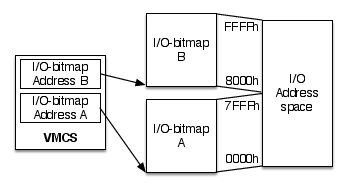

---
authors:
- 'Takuya ASADA syuu@dokukino.com'
title: '第 3 回 I/O 仮想化「デバイス I/O 編」'
...

ハイパーバイザによるI/O デバイスエミュレーション方法
====================================================

OSの主要な機能の1つに、コンピュータ上の各種
デバイスに対するアクセス(デバイスへのI/O)の抽
象化が挙げられます。OS上で動作するアプリケー
ションは、ファイルシステムやソケットインター
フェースなどの形に抽象化されたものを用いて、デ
バイスへアクセスを行います。今回は、仮想化環境
でゲストOSのデバイスアクセスをどのように仮想
化するか、これに焦点を当て解説します。

I/O デバイスへのアクセスとハードウェアレジスタ
==============================================

OSのうち、各種デバイスに対するアクセス機能を
司るプログラムをとくに「デバイスドライバ」と呼び
ます。では、デバイスドライバとデバイスとのやり
とりはどのように行われるのでしょうか。それぞれ
のデバイスは、デバイスをソフトウェア(デバイスド
ライバ)から制御するためのハードウェアレジスタを
持っています。OSはデバイスドライバを用いてこの
ハードウェアレジスタを読み書きすることによって
「HDDのセクタを読み取る」「LANへパケットを送出
する」「画面を描画する」などの目的を果たしていま
す。また、デバイスによっては割り込み機能やDMA 機能を持っています[^1]
。デバイスアクセスの例とし
て、シリアルポートの受信処理を見てみましょう。

シリアルポートの受信処理 {#シリアルポートの受信処理 .unnumbered}
------------------------

    unsigned char read_com1(void) {
      while ((read_reg_byte(COM1_LSR) & 1) == 0);
      return read_reg_byte(COM1_RBR);
    }

リスト 1 は、最も単純に実装した場合のシリアル
ポートの受信処理のコードです。解説を単純化する
ため、初期化処理や割り込みの処理などは割愛して
います。シリアルポートからデータを受信するに は、Line Status
RegisterのData Availableビットを
チェックしてデータが着信するまで待ちます。そし て、データが着信したら
Receiver Buffer Register から読み取ります。
複数バイトのデータを読み出すには、バイト数分
この処理を繰り返す必要があります。ここではLine Status
Registerのチェック処理をビジーウェイトで
実装していますが、実際のドライバではビジーウェ
イトはCPU時間を無駄に消費し、他の処理の実行を
阻害するのでほとんどの場合使いません。代わりに
割り込みを用います。シリアルポートの受信割り込 みの場合、Data
Availableビットが立つタイミングで
割り込みを発生することができます。このため、ド
ライバは割り込みハンドラでリスト1と同様のコー
ドを実行すれば、ビジーウェイトを避けて受信処理 を行うことができます。

I/O マップド I/O とメモリマップド I/O
=====================================

各デバイスのハードウェアレジスタの読み書き(デ
バイスへのI/O)はどのように実現されているので
しょうか。ここの方法として、I/OマップドI/Oとメ
モリマップドI/Oの二種類の方式があり、通常アー
キテクチャごとにどちらかの方式をとります。しか
し、x86アーキテクチャでは、歴史的な事情により両 方式を併用しています。
I/OマップドI/Oでは、メモリ空間とは独立した
デバイス専用のアドレス空間(I/O空間)が存在して
おり、ここに各デバイスのハードウェアレジスタを
割り付けます。なお、どのデバイスをどの番地にす
るかは、固定的に決まっているアーキテクチャと動
的に決まるアーキテクチャとがあります。 I/O空間へ は専用の命令(IN命令、
OUT命令)を用いてアクセス を行います。前述のシリアルポートの受信処理の
read\_reg\_byte()関数及びレジスタの宣言はリスト2 のようになります。

    #define COM1_PORT (0x3f8)
    #define COM1_LSR (COM1_PORT + 0)
    #define COM1_RBR (COM1_PORT + 5)
    unsigned char read_reg_byte(unsigned short port) {
      unsigned char val;
      asm volatile("inb %1, %0" : "=a"(val) : "Nd"(port));
      return val;
    }

一方、メモリマップドI/Oでは、各デバイスの
ハードウェアレジスタをメモリ空間の一部に割り付
けます。こちらも、どのデバイスをどの番地にする
かは、固定的に決まっているものと動的に決まるも
のとがあります。ハードウェアレジスタへのアクセ
スにはMOV命令など通常のメモリアクセスと同様
の手順を用います。前述のシリアルポートの受信処
理のread\_reg\_byte()関数及びレジスタの宣言はリス ト3のようになります。

    #define COM1_PORT (0x40100000)
    #define COM1_LSR ((void *)(COM1_PORT + 0))
    #define COM1_RBR ((void *)(COM1_PORT + 5))
    unsigned char read_reg_byte(void *addr) {
      return *((unsigned char *)addr);
    }

ゲストマシン上で各種デバイスをサポートするに
は、この2つの種類のI/Oを仮想化し、アクセスさ
れたデバイスに応じたエミュレーション処理を行う 必要があります。

VT-x における I/O エミュレーションの基本的な考え方
==================================================

連載1回目の「VT-xを用いたハイパーバイザのラ
イフサイクル」で解説したとおり、次のようなループ
の繰り返しによりデバイスI/Oのエミュレーション を行います。

1.  [ゲスト]ゲスト環境上でデバイスへのI/Oが実行される

2.  [ゲスト]I/Oの実行を契機にVMExit発生

3.  [ハイパーバイザ]アクセス先のデバイス、アクセス幅、アクセス方向、書き込み先・読み込み元などを特定

4.  [ハイパーバイザ]デバイスI/Oのエミュレーション処理を行う

5.  [ハイパーバイザ]VMEnter してゲストを再開させる

6.  [ゲスト]I/O実行の次の命令から実行再開

この処理は、ハードウェアレジスタへの読み書き
が行われるごとに繰り返されます。したがって、1回
のハードウェアアクセス処理に必要なハードウェア
レジスタへのアクセス回数が多ければ多いほどオー
バーヘッドが大きくなります。

VT-x における I/O マップド I/O のハンドリング方法
=================================================

VT-xにおいてI/OマップドI/Oをハンドリングす
るには、まずVMCSへ設定を行ってI/Oポートへの
アクセス時にVMExitを発生させる必要があります
(VMCSについては、連載1回目と2回目を参照して ください)。
設定には2とおりあり、すべてのI/Oポートへの
アクセスでVMExitを発生させる設定と、特定のI/O
ポートへのアクセスにのみVMExitを発生させる設
定です。すべてのI/OポートへのアクセスでVMExit
を発生させるには、VMCSのVM-Execution Control FieldsのUnconditional I/O
exitingを1にします。ま た、特定のI/OポートへのアクセスにだけVMExit
を発生させるには、VMCSのVM-Execution Control FieldsのUse I/O
bitmapsを1にして、VM-Execution Control Fields の I/O-Bitmap Address A と
I/O-Bitmap Address BにI/O-bitmap AとI/O-bitmap Bのアドレスを設定します。
I/O-bitmap BはI/Oポー
ト番号8000HからFFFFHまでを表す同様のテーブルです(図[fig1])。

 [fig1]

これらの設定でI/Oアクセス時のVMExitを有効に
し、ゲストOSがデバイスドライバ経由でI/Oポート へアクセスを行うと、VMExit
Reason 30 (I/O Instruction)のVMExitが発生します。Exit要因は
VMCSのVM-Exit Information FieldsのExit reason
フィールドに書かれており、ハイパーバイザはこれ
をもとにExit要因に合わせた処理を行います。
今回の例の場合はデバイスへのI/Oアクセスをエ ミュレーションしますが、
Exit要因だけでは何番のI/ Oポートへアクセスされているのか、アクセス方向
が読み込みだったのか、あるいは書き込みだったの
かがわかりません。これらの情報は、VM-Exit Information FieldsのExit
qualificationフィールドで 提供されます(表[tab1])。

|l|l|

ビットポジション & 内容\
2:00 & アクセスサイズ(0 = 1byte、1 = 2byte、3 = 4byte)\
3 & アクセス方向(0 = 書き込み、1 = 読み取り)\
4 & String 命令(0 = 非 string、1 = string)\
5 & REP プレフィックス(0 = REP あり、1 = REP)\
6 & ポート番号指定方法(0 = DX 間接、1 = 即値)\
15:07 & Reserved\
31:16:00 & ポート番号\
63:32:00 & Reserved\

[tab1]

このフィールドはExit要因ごとに異なる追加情報 を提供しており、VMExit
Reason 48の場合は表[tab3]の ような情報を提供します。ハイパーバイザはExit
qualificationフィールドからポート番号などの情報を
読み込み、ポート番号に合わせたデバイスエミュ
レーション処理を実行します。デバイスエミュレー
ション処理を行う際、アクセス方向が読み込み方向
ならば読んだデータの書き込み先、書き込み方向な
らば書き込むデータの読み込み元を把握する必要が
あります。しかし、I/Oポートアクセスの場合は非
string命令(IN/OUT)ならばEAXレジスタを使うこ
と、string命令(INS/INSB/INSW/INSD/OUTS/
OUTSB/OUTSW/OUTSD)ならばES:ESIで指定さ
れたメモリアドレスを使うこと、と固定的に決めら
れています。このため、Exit qualificationのビット4
を見てstring命令か否かを判別すれば、ハイパーバ
イザのエミュレーション処理において、どこから書
き込み先/読み込み元を取得すれば良いのかがわか ります。

VT-x におけるメモリマップド I/O のハンドリング方法(シャドーページングの場合)
============================================================================

VT-xにおけるメモリマップドI/Oは、メモリ仮想
化がソフトウェアで行われている(シャドーページン
グ)か、ハードウェアで行われている(EPT)かで2と
おりあります。まず、シャドーページングの場合か ら説明します。
シャドーページング環境においてメモリマップド
I/Oをハンドリングするには、デバイスがマップさ
れたアドレスへのアクセスが発生した時に、ページ
フォルトを発生させる必要があります。そのために、
シャドーページテーブル上のデバイスがマップされ
たアドレスに対応するページテーブルエントリのプ
レゼントビットを0にします。 前回の記事で説明したとおり、シャドーページン
グ時にはVMCSのVM-Execution Control Fieldsの Exception
Bitmapの14bit目(page fault exception)に
ビットを設定して、ページフォルトでVM ExitReason 0 (Exception or
non-maskable interrupt)を発生させま す。
VMExitが発生した時、ハイパーバイザはExit要
因が0であることを確認したあと、 VMCSのVM-Exit Information Fieldsに あ
るVM-exit interruption informationを参照します(表[tab2])。

|p4.5cm|p10cm|

ビットポジション & 内容\
7:00 & 割り込みベクタ番号\
10:08 & 割り込みタイプ(0 =外部割り込み、2 = NMI、3
=ハードウェア例外、6 =ソフトウェア例外)\
11 & Error code が正常\
12 & IRET による NMI ブロック解除\
30:13:00 & Reserved\
31 & VM-exit interruption information が正常\

[tab2]

この場合、ハイパーバイザは割り込みベクタ番号 が14 (
\#PF例外)で、割り込みタイプがビット3 (ハー ドウェア例外)で、VM-exit
interruption information が正常であることを確認します。ページフォルトで
VMExitしたことが確認されたら、前述のExit
qualificationフィールドを読み込みます。ページフォ
ルト例外によるVMExitの場合、このフィールドに
はCR2レジスタの値(ページフォルト例外が発生し
たリニアアドレス)になっています。
さて、これでメモリマップドI/O対象のアドレス はわかりました。しかし、
I/Oポートアクセスのとき にはExit qualificationフィールドから取得できてい
たアクセスサイズ、アクセス方向、データの書き込
み先・読み込み元がわかりません。実はVT-xではこ
れらの情報を提供していないのです。これらの情報
を得るため、ハイパーバイザは次のような処理を実 行する必要があります。

1.  ページフォルト例外発生時のRIP [^2] をVMCSのGuest-State
    AreaのRIPフィールドから取得

2.  ゲストマシンのメモリ空間へアクセスして命令のバイト列を読み込み

3.  命令をデコードしてアクセスサイズ、アクセス方向、データの書き込み先・読み込み元を取得

4.  3の情報を元にしてデバイスアクセスのエミュレーションを実行

つまり、メモリマップドI/Oを実施した1命令に
限りソフトウェアエミュレーション処理を行うこと になります。
当然ながら、この処理の分I/OマップドI/Oと比
較してオーバーヘッドが高くなります。

VT-x におけるメモリマップド I/Oのハンドリング方法( EPT の場合)
==============================================================

EPT環境においてメモリマップドI/Oをハンドリ
ングする場合は、デバイスがマップされたアドレス
へのアクセスが発生した時に、VMExit reason 48 (EPT
violation)でVMExitさせる必要があります。
そのために、EPT上のデバイスがマップされたアド
レスに対応するページテーブルエントリのRead accessビットとWrite
accessビットをどちらも0に します。これによってゲストマシンがデバイスが
マップされたアドレスへアクセスした時にVMExit
が発生するようになります。VMExitが発生したと
き、ハイパーバイザはExit要因が48であることを確 認したあと、
VMCSのVM-Exit Information Fieldsに あるGuest-physical
addressを読み込みます。このア ドレスが、VMExit Reason
48を発生させたアクセス (デバイスへのI/O)になります。さらに、VM Exit
qualificationフィールドを参照するとアクセス方向
(readまたはwrite)を得ることができます。しかし、
I/Oをエミュレーションするにはアクセスサイズ、
データの書き込み先・読み込み元などの情報が足りま せん(表[tab3])。

|p3.2cm|p13cm|

ビットポジション & 内容\
0 & EPT violation の原因は data read\

1 & EPT violation の原因は data write\

2 & EPT violation の原因は instruction fetch\

3 & アクセスされたページに対応するEPTエントリのread
accessと、このExit qualificationの0 ビット目との AND\

4 & アクセスされたページに対応するEPTエントリのwrite
accessと、このExit qualificationの1 ビット目との AND\

5 & アクセスされたページに対応するEPTエントリのexecute
accessと、このExit qualificationの 2 ビット目との AND\

6 & Reserved\

7 & VMCS の VM-Exit Information Fields の Guest-linear address が有効\

8 & 1 = EPT violation
の原因がゲストフィジカルアドレスへのアクセス\
& 0 = EPT violation の原因が EPT のページウォーク中や EPT
のページテーブルエントリの更新\

11:09 & Reserved\

12 & IRET による NMI ブロック解除\

63:13:00 & Reserved\

[tab3]

シャドーページングの場合と同様に、VT-xはこれ
らの情報を提供していません。このため、ハイパー
バイザはシャドーページングの場合と同様にExit要
因になった命令をソフトウェアエミュレーションす
る必要があります。このため、メモリマップドI/O
のハンドリングにおいては、EPTでもシャドーペー
ジングの場合と同様にオーバーヘッドが発生しま す。[^3]

Local APIC 仮想化
=================

Pentium Pro以降のIntelのCPUにはLocal APIC
という割り込みコントローラが内蔵されており、こ
れがすべての割り込みの管理を行っています。Local
APICへのアクセス頻度は非常に高く、割り込みが
発生するたびに割り込みハンドル終了を通知するた
めEOIレジスタへの書き込みを行います。さらに一 部のOS (おもにWindows
XP)では割り込み優先度を 変更するためにTPRレジスタの値を頻繁に書き換え
ます。また、クロックもLocal APICへ統合されて
いるので、クロック割り込みごとにレジスタアクセ スが行われます。
ゲストOSからこのような高頻度のアクセスが行
われると、頻繁にVMExitが発生し毎回レジスタア
クセスのハンドリング処理を行わなければなりませ
ん。これらのオーバーヘッドが積み重なりゲストマ
シンのパフォーマンスが低下してしまうので、これ を避けるためLocal
APICの仮想化に関する機能が いくつか導入されています。

APIC access VMExit
==================

VT-xにはAPIC access VMExitと呼ばれるLocal
APICへのレジスタアクセス専用のExit要因が用意
されています。これは、アクセス頻度の高いLocal
APICへのレジスタアクセスのハンドリング処理を
最適化しやすくするためのものだと思われます。 APIC access VMExit
を使うには、VMCS の VM- Execution fields で Virtualize APIC accesses
を有効 化し、シャドーページや EPT がゲスト環境の Local APIC
アドレスの範囲に割り当てている物理ページ (APIC access page
と呼ぶ)のアドレスを VMCS の VM-Execution fields
へ設定します。これにより、 APIC access page へアクセスが発生した際に、
VMExit reason 44 (APIC access)が発生するように なります。このとき、VM
Exit qualification を参照す
ると(表[tab4])、アクセスのあったレジスタとアクセス方 向(read だったのか
write だったのか)がわかります。

  ビットポジション   内容
  ------------------------ --------------------------------------------------------
  11:00                    アクセスのあったレジスタ(APIC page からのオフセット)
  15:12                    アクセスタイプ(read、write、execute など)
  63:16:00                 Reserved

[tab4]

これだけの情報では命令エミュレーションが避け
られないレジスタもありますが、 EOIレジスタに関し ては「write
only・0を書くこと」と使い方がきわめて
限定的に決まっているので命令エミュレーションを
スキップしてハンドリングを完了させることができ
ます。前述のとおりアクセス頻度が高いレジスタで
あるため、これだけでもそれなりのオーバーヘッド 軽減が見込めるようです。
なお、APIC access pageに対してメモリマップド
I/OハンドリングのためにページフォールトやEPT
Violationが発生する設定をページテーブルエントリ
へ行なっている場合、ページフォールトやEPT
Violationが優先されるため注意が必要です。

TPR shadow
==========

通常のメモリマップドI/Oのハンドリング方式で
はTPRレジスタへのアクセスは無条件にVMExitを
引き起こします。TPRレジスタのしくみ上、 VMExit
を用いたハイパーバイザからの介入が必要なのは、
ある値より優先度を下げる方向の書き込みだけです。
それ以外のケースでは、ゲストOSから読み書きが
正常に行えさえすればよく、VMExitを発生させる必 要がありません。
このような挙動を実現させるため、 VT-xではTPR
shadowという機能を用意しています。 TPR shadowを
使うには、VMCSのVM-Execution fieldsでTPR shadowを有効にし、 Virtual APIC
Pageと呼ばれる物 理ページをTPRの値を格納する場所として用意し、
VMExitを発生させるしきい値をTPR thresholdとい うパラメータで指定します。
ゲストからTPRへのアクセスが発生した時、TPR の値がTPR
thresholdを下回るとVMExit Reason 43 TPR below
thresholdでVMExitします。下回らな かった場合はVMExitせずにVirtual APIC
Pageを 使ってTPRのアクセスが仮想化されます。

APIC-Register virtualization
============================

TPR shadowで用いられているVirtual APIC Page を用いたLocal
APICレジスタ仮想化のしくみは、 最新のIntel
CPUでは他の割り込み関連レジスタ群
へも範囲が広げられています。これにより、VMExit
回数をより減らすことができるようになりました。
このように、同じ「VT-x」と呼ばれている機能で も CPU
の世代によって少しずつ改良が加えられて おり、そのつど CPU
側でできることが増えてきて います。

まとめ
======

いかがでしたでしょうか。今回はIntel VT-xにお
けるデバイスI/Oエミュレーションの実装方法を中
心に解説してきました。次回は「割り込みの仮想化」 を中心に解説します。

ライセンス
==========

Copyright (c) 2014 Takuya ASADA. 全ての原稿データ は
クリエイティブ・コモンズ 表示 - 継承 4.0 国際
ライセンスの下に提供されています。

[^1]: 割り込みは OS へ何らかのメッセージを通知するために用いられます。
    また、 DMA は CPU 負荷を下げるためにデバイスからCPU を介さず直接
    データをメモリへ転送する機能です。

[^2]: RIP は実行中の命令のアドレスを持つレジスタ。 32bit モードでは EIP
    と呼ばれます。

[^3]: EPT が一般的にシャドーページングより高い性能が出せない
    という意味ではなく、メモリーマップド I/O に限っては性能が
    変わらないという意味です。
