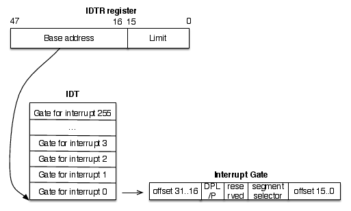
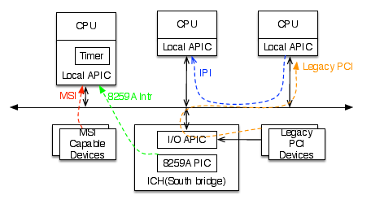

# 第 4 回 I/O 仮想化「割り込み編・その 1 」

## 割り込みの種類

前回の記事ではI/O仮想化の機能のうち、I/Oデバ
イスへのアクセスをエミュレーションする方法を中
心に解説してきました。今回は、割り込み仮想化の
話の前提となるx86アーキテクチャにおける割り込
みのしくみを解説します。
CPUが持つ機能として、割り込みというものがあり
ます。これは、現在CPU上で実行しているプログラム
を停止して、別の処理を実行するための機能です。
CPUより処理速度の遅い周辺機器へのI/Oを非同
期に行うため、周辺機器からCPUへI/O終了を通知
する機能として実装されました。現在では、より広
い用途で用いられています。

### 外部割り込み、内部割り込み

割り込みは、外部割り込みと内部割り込みの2種
類に分けられます。外部割り込みとは、ハードウェ
アからCPUへ「キーボード押された」などのイベント
通知を行うのに用いられます。外部割り込みは、さ
らにマスク可能な割り込みとソフトウェアからマス
ク可能な割り込み(NMI) の2種類に分類されます。
マスク可能な割り込みは通常のデバイスからの割り
込みに用いられます。また、NMIはハードウェア障
害の通知など一部特殊な用途に用いられます。
内部割り込みとは、CPU内部の要因で発生する割
り込みのことです。この内部割り込みは、ソフト
ウェア割り込みと例外に分類されます。ソフトウェ
ア割り込みとは、割り込みを起こす命令(INT命令)
により発生する割り込みです。これはシステムコー
ルの実装に用いられます。例外とは、プログラムを
実行した結果としてゼロ除算/オーバーフロー/無
効な命令の実行/ページフォルトなどが発生したと
きなどに起きる割り込みです。これは、CPUで実行
されるプログラムの制御に用いられます。

## ベクタ番号と IDT

これらすべての種類の割り込みに0-255のベクタ
番号が割り当てられます。例外は要因別に0-19、
NMIは2が固定的に割り当てられています。ソフト
ウェア割り込みは0-255のすべてのベクタ番号を使
用可能、外部割り込みは16-255を使用可能になって
います。
割り込みを使用するにはIDT(Interrupt Descriptor
Table)と呼ばれる割り込みハンドラのアドレスを格
納する最大255エントリのテーブル(配列)を作成し、
IDTのアドレスをIDTRレジスタに設定する必要が
あります。割り込み発生時、CPUはIDTRの値から
IDTを参照し、指定された割り込みハンドラを実行
します。
IDTの各エントリはGate Descriptorと呼ばれる
フォーマットで記述されます。これは単なるメモリ
アドレスではなく、セグメントの設定や実行権限
(Ringの値)、リアルモード・プロテクトモードの設
定などいくつかのパラメータを含みます(図[fig1])。

IDTに用いられるGate DescriptorにはTask gate
descriptor/Interrupt gate descriptor/Trap gate
descriptorの3種類があります。しかし、Task gate
descriptorはハードウェアによるマルチタスク機能を
呼び出すためのもので、現代のOSでは使われていま
せん。代わりにInterrupt gate descriptorとTrap gate
descriptorが用いられます。
この2つの違いは、Interrupt gate descriptorが
EFLAGSレジスタのIFフラグ(割り込みフラグ)を
クリアするのに対して、Trap gate descriptorはIFフ
ラグをクリアしない(割り込みハンドラ内で割り込み
を禁止しない)というものです。
IDTRレジスタのフォーマットは、IDTの先頭アド
レスとLimit値(テーブルのサイズ)の組み合わせに
なっており、 255未満のテーブルサイズに対応できる
ようになっています。

## 割り込みのマスク・アンマスク

EFLAGSレジスタ(Intel 64ではRFLAGSレジス
タ)のIFフラグをクリアすると割り込みを禁止、IFフ
ラグをセットすると割り込みを有効にすることがで
きます。プログラムからIFフラグをクリア/セット
するには、CLI命令/STI命令を使用します。
また、前述のとおり、Interrupt Gate Descriptorを
使用して割り込みをハンドルする場合はCPUによっ
て IF フラグがクリアされるため、割り込みは自動
的に禁止されます。このとき、割り込みハンドラを
終了して割り込み前に実行していたプログラムへ制
御を戻すIRET命令を実行すると、割り込み前の
EFLAGSレジスタの値がリストアされ、再び割り込
み可能になります。

## 外部割り込みと割り込みコントローラ

オリジナルのPCアーキテクチャでは、外部割り
込みを制御し、CPUへ伝える役割を受け持つ割り込
みコントローラとしてPIC (i8259)がありました。こ
れは、マザーボード上に存在し、CPUの割り込みラ
インに接続されていました。Pentium以降のx86アー
キテクチャでは、外部割り込みの管理はAPIC
(Advanced Programmable Interrupt Controller)と呼
ばれる新しい割り込みコントローラへ移行され、
PICは互換性のためのみに存在するようになりま
した。APIC は CPU ごとに存在し、CPUに内蔵さ
れているLocal APICと、ICH (Southbridge)に内蔵さ
れているI/O APICから構成されています(図[fig2])。

Local APICは、ローカル割り込みのベクタ番号設
定、割り込みベクタ番号通知、EOI (割り込み終了)通
知など、一般的な割り込みコントローラの役割を受
け持ちます。また、タイマー/温度センサ/パ
フォーマンスモニタリングカウンタなどのデバイス、
IPI (プロセッサ間割り込み)の送受信機能を内蔵して
います。
一方、I/O APICは外部デバイスから割り込みを受
け取り、I/O APIC上の設定に基いて割り込み配信先
のLocal APICを選び割り込みをリダイレクトする
機能を受け持ちます。
このような構成を取ることによって、SMP環境下
で複数のCPUで外部割り込みを処理できるように
なっています。
また、あるCPUのLocal APICから別のCPUの
Local APICへIPI ( Inter-Processor Interrupt:プロ
セッサ間割り込み)を送ることもできます。

## Local APIC

 表[tab1]に割り込みの処理で利用されるLocal APICの
主なレジスタを示します。
表 1   Local APIC の主なレジスタ
割り込み着信時の Local APIC および CPU
の挙動を簡単にまとめると、次のよう流れになります。
1. Local APICが割り込みを受信したら、IRRに対応するベクタ番号のビットをセットする。CPUが割り込みをブロックしている場合はここで処理は終わり
2. IRRにセットされた最高優先度のビットをクリア、同じビットをISRにセット、同じ優先度の割り込みをCPUへ発行する
3. CPUで割り込みハンドラが実行される
4. CPUで実行された割り込みハンドラがEOIレジスタに書き込み、割り込み処理の終了を伝える
5. EOIレジスタへの書き込みを受け取ると、ISRにセットされた最高優先度のビットをクリア。まだISRにビットが残っていたら2から繰り返し

ただし、タスク優先度/プロセッサ優先度という
機能があり、これによって割り込みに対する実行中
タスクの優先度が制御でき、タスクの優先度が受信
した割り込みより高い場合、その割り込みはマスク
されます。
TPR ・ PPRレジスタの値は優先度クラス(4-7bit)・
サブ優先度クラス(0-3bit)の2つの値からなり、優先
度クラスだけが割り込みのマスクに使用されます。
先度サブクラスは後述の「Lowest priority Mode」
で使われますが、割り込みのマスクには使用されま
せん。
PPRの更新はTPRに新しい値が書き込まれたと
きとCPUに割り込みを発行するとき(前述の割り込
み着信時の手順2の段階)に行われます。値は次のよ
うに設定されます。
/* [7:4] は優先度クラス */
/* [3:0] は優先度サブクラス */
if TPR[7:4] >= ISR[7:4]

### PPR = TPR

else

### PPR[7:4] = ISR[7:4]

### PPR[3:0] = 0

また、Local APICに割り込みが着信した段階(前
述の割り込み着信時の手順1の段階)で、IRRにセッ
トされた最高優先度のビットとPPRの優先度クラス
(4-7bit)が比較されます。
PPRの優先度クラス(4-7bit)のほうが高かった場合
は割り込みがマスクされます。

## I/O APIC

I/O APICには外部デバイスからの割り込み線が接
続され、24本の割り込みをサポートしています。各割
り込みの割り込み先はI/O APIC上のRedirection
Tableに設定され、システムバスを通じてCPUの
Local APICへ転送されます。Redirection Tableの各
エントリのフィールドの詳細を表[tab2]に示します。
表 2   I/O APIC の Redirection Table Entry
Redirection Table EntryではDestination Modeを
指定する必要があります。Destination Modeに
Physical Destination Modeを指定した場合、 Destination
フィールドにLocal APIC IDを指定することによ
り、宛先CPUを一意に特定します。たとえば、Local
APIC ID: 3のCPUへ割り込みを配信したいときは、
Destinationフィールドに3を指定します。
Logical Destination Modeを指定した場合、
Destinationフィールドで複数の宛先CPU群をビッ
トマスク指定します([^1])。宛先CPUのIDはLocal
APIC IDではなく、LDRのLogical APIC IDが使用
されます。たとえば、LDRの値が00000001bのCPU
と00000010bのCPUに割り込みを配信したい場合、
Destinationフィールドに00000011bを指定します。
Logical Destination Modeにより複数のCPUが割
り込み先に指定された時の挙動については、 Delivery
Modeで設定します。Fixed Modeでは、 Destinationに
指定されたすべてのCPUに割り込みます。Lowest
priority Modeでは、 DestinationのうちLocal APICの
TPRが最も小さいCPUへ割り込みます。TPRの値が
最も小さいCPUが複数存在する場合は、ラウンドロ
ビンで割り込みが分散されます([^2])。いずれの配信モー
の場合でも、Vectorフィールドで設定されたベク
タ番号でLocal APICへ割り込みがかかります。
APIC IDのアドレス幅は8bitですので、Logical
Destination Modeでは最大8CPUしかサポートでき
ません。このため、 Nehalem世代よりx2APICと呼ば
れる拡張版APICが導入され、アドレス幅は8bitか
ら32bitへ拡張されました([^3])。

[^1]: これは正確には Logical Flat Model というモードで、他に FlatCluster Model 、 Hierarchical Cluster Model などがありますが、通常使われません。説明は割愛します。注 2 ) Windows ではプロセスごとに TPR の値を制御し、プロセスの優先度に多じて割り込み量を変化させています。一方、 Linuxでは TPR の値は変えずに Lowest Priority を用い、複数の CPUへ割り込みを公平に分散させています。注 3 ) 参考資料 Intel64 Architecture x2APIC Specification( http://www.intel.com/content/dam/doc/specification-update/64-architecture-x2apic-specification.pdf )

## MSI・MSI-X 割り込み

I/O APICを経由するPCIデバイスの割り込みは、
各PCIデバイスからの物理的な割り込み線がI/O
APICへ接続され、この割り込み線を通じて割り込
みが送信されていました。
この構成では割り込みの数とIRQの割り当てが物
理配線に依存するため、限られたIRQを複数のデバ
イスで共有するようなしくみになっていました。ま
た、1つのデバイスで複数の割り込みを持つことはで
きませんでした。この制限を解消するため、物理配
線を用いずPCIバス経由のメッセージとして割り込
みを送るMessage Signalled Interrupt (MSI)・Extended
Message Signalled Interrupt (MSI-X)が導入されてい
ます。PCIではオプション機能として提供されていま
すが、PCI expressでは必須とされています。
MSIでは各デバイスごとに32個、 MSI-Xでは2048
個の割り込みをサポートします。従来と異なり、デ
バイス間の割り込みは共有されません。MSI ・ MSI-X
の割り込みはIO-APICを経由せず、直接Local
APICへ配送されます(図[fig2]参照)。このとき、宛先
CPUの設定は各PCIデバイスのコンフィギュレー
ションスペースに設定されます。詳細は割愛します
が、コンフィギュレーションスペース内の割り込み
の設定フィールドでは、表[tab2]のRedirection Table
Entryに近い内容が割り込みごとに設定できます([^4])。

[^4]: 参考資料http://d.hatena.ne.jp/syuu1228/20120105/1325757315

## まとめ

いかがでしたでしょうか。今回はx86アーキテク
チャにおける割り込みのしくみを解説してきました。
次回は、今回解説した割り込みのしくみをどう仮想
化するかについて解説します。
ライセンス
==========

Copyright (c) 2014 Takuya ASADA. 全ての原稿データ は
クリエイティブ・コモンズ 表示 - 継承 4.0 国際
ライセンスの下に提供されています。
