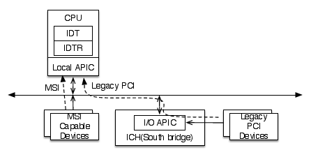

# 第 5 回 I/O 仮想化「割り込み編・その 2 」

## はじめに

前回の記事では、割り込み仮想化の話の前提とな
るx86アーキテクチャにおける割り込みのしくみを
各コンポーネントごとに解説しました(図[fig1])。仮想
環境でどのように割り込みを実現するのか、前回解
説した各機能ごとに見ていきます。

## 仮想化における内部割り込みと外部割り込み

VT-x環境においては、内部割り込みはCPUがす
べて処理を行うため、基本的にハイパーバイザが介
入する必要がありません。一方、外部割り込みにつ
いては、ハイパーバイザの介入が必要となります。
それぞれを見ていきましょう。

### CPU への割り込みの挿入

仮想 CPU で任意の割り込みを発生させるに
は、VMCS の VM-Entry Control Fields にある
VM-entry interruption-information field にベクタ
番号と割り込みタイプを書き込みます(表 1)。た
だし、このフィールドに値をセットして外部割り
込みを発生させるだけでは、Local APIC のレジ
スタ値は適切に更新されず、ハイパーバイザが新
しい値を計算しセットする必要があります。
▼表 1   VM-entry interruption-information field

### 内部割り込みの仮想化

実機での内部割り込みは、次の手順で処理されます。
1. ゲストマシン上のソフトウェアが例外を発生させるか、INT命令の実行によりCPUで内部割り込みが発生
2. CPUはIDT上のゲートデスクリプタを読み込み、割り込みハンドラを実行
3. 割り込みハンドラが内部割り込みを処理
4. IRET命令で直前のコンテキストへ復帰

これらはすべて、ハイパーバイザの介入が不要で
す②〜④については、 IDT/IDTR の仮想化にて説明し
ます。ただし、ここでもVMCSの設定により、内部
割り込みを契機としてVMExitを発生させることが
できます([^1])。ただし、この利用方法は一般的ではあり
ません。
[^1]) VMCS の VM-Execution Control Fields の Exception Bitmap
　　 の各ビットが各例外のベクタ番号に対応していて、ここに1
　　 を設定するとその例外が発生した時に VMExit が発生するよう
　　 になります。通常の例外は基本的に VMExit する必要がありま
　　 せんが、連載第 2 回( Intel VT-x の概要とメモリ仮想化)で解説
　　 したシャドーページングを行うには、ページフォルト例外で
　　 の VMExit が必須になります。

### 外部割り込みの仮想化

内部割り込みはソフトウェアを起因としCPU内部
で発生するため、VT-xによりハイパーバイザの介入
なしに仮想化することが可能でした。一方、外部割
り込みは、ハイパーバイザが割り込みを送り込みま
す。これは、デバイスがソフトウェア的に、ハイ
パーバイザ内に実装されているためです。
・I/O APIC を通して割り込む場合
実機でのI/O APICを通して割り込む場合の外部
割り込みは、次のような手順で処理されます。
1. デバイスが割り込みラインからI/O APICへ割り込みを送信
2. I/O APICが割り込みを受け取り、RedirectionTable Entryに指定されたDestination IDが示すLocal APICへ割り込みを転送
3. Local APICがCPUへ割り込み
4. CPUはIDT上のゲートデスクリプタをロードし、割り込みハンドラを実行
5. 割り込みハンドラが外部割り込みを処理
6. 割り込みハンドラがLocal APICへEOIを書き込み、割り込み処理の終了を伝達
7. IRET命令で直前のコンテキストへ復帰

このうち、④、⑤、⑦については内部割り込みと
同様の処理であり、ハイパーバイザの介入は必要あ
りません。①〜③は次のように仮想化されます。ま
ずあらかじめ、ゲストOSが割り込みを初期化する
ときにI/O APICのRedirection Table Entryへ宛先
Local APICが設定されます。実際にデバイスが使わ
れ始め、ハイパーバイザがデバイスのエミュレー
ションを行うと、割り込みを仮想CPUへ送る必要が
出てきます。
デバイスエミュレータからの割り込みを受け、ハ
イパーバイザはデバイスに対応するRedirection
Table Entryの値を参照し、宛先の仮想CPUを選び
ます。宛先の仮想CPUが決定されたら、ハイパーバ
イザは宛先CPUのLocal APICのIRRレジスタを更
新し、VMCSに割り込みの挿入を設定します。割り
込み挿入が設定された仮想CPUがVMEnterされる
と、以降は内部割り込みと同様に、実機とほぼ同じ
手順で割り込みの受付が行われて割り込みハンドラ
が起動されます。
⑥のEOI書き込みに関しては、Local APICのEOI
レジスタへのアクセスを、ハイパーバイザが介入し
てエミュレーションを行う必要があります。
まとめると、外部割り込みを仮想化するには、ハイ
パーバイザでIO APIC・Local APICのエミュレーショ
ンを行い、仮想CPUへ割り込みを挿入する必要があ
ります。
・MSI/MSI-X 割り込みを用いて割り込む場合
実機では、次の手順で処理されます。
1. デバイスがPCI Configuration Spaceに指定されたDestination IDが示すLocal APICへ割り込みを転送
2. Local APICがCPUへ割り込み
3. CPUはIDT上のゲートデスクリプタをロードし、割り込みハンドラを実行
4. 割り込みハンドラが外部割り込みを処理
5. 割り込みハンドラがLocal APICへEOIを書き込み、割り込み処理の終了を伝達
6. IRET命令で直前のコンテキストへ復帰

MSI/MSI-X割り込みを用いる場合の違いは、割
り込み先がI/O APICのRedirection Table Entryに
書いてあるのではなく、PCI Configuration Spaceに
書いてある、という点だけです。これを仮想化する
場合、ハイパーバイザで宛先の仮想CPUを選択する
ときの参照先が変わりますが、あとはI/O APICを
通じた割り込みと同じです。

## IDT/IDTR と割り込みハンドラ

IDT/IDTRや割り込みハンドラに関しては、とくに
ハイパーバイザが介入すべき処理はありません。この
ためVMExitは発生せず、すべてCPUが仮想化を行
います([^2])。VT-x において一部の汎用レジスタはVMX
root mode/VMX non-root modeの切り替えときにコン
テキストをハイパーバイザで保存する必要がありまし
た。しかし、IDTRレジスタのコンテキスト保存/復
帰については、ハイパーバイザは関与しません。
これは、CPUによって行われるためです。ゲスト
マシン上のIDTの作成や割り込みハンドラのアドレ
スの設定は、通常のメモリアクセアスと同様に行わ
れます。また、VT-x non-root mode では、実機での
動作と同様に割り込みや例外を受け付け、割り込み
ハンドラを実行する機能が備わっています。ゲスト
マシンのIDTRは、 IDTの構築後に設定されます。な
お、一般的な手法ではありませんが、VMCSの設
定([^3])によりIDTRへの読み書きを契機としてVMExit
を発生させることもできます([^4])。
このうち、②〜④でハイパーバイザの介入が不要
であることは、すでに説明しました。①ですが、ゲ
スト環境から内部を発生させ、割り込みハンドラを
起動する処理の中で、とくにハイパーバイザの介入
は必要ありません。
ただし、ここでもVMCSの設定により、内部割り
込みを契機としてVMExitを発生できま。この場合、
内部割り込みをゲストOSに渡さずハイパーバイザ
で横取りして処理をしたり、デバッグ機能としてゲ
スト環境上の内部割り込みの回数をカウントしたり
といった機能を実装できます。しかしながら、その
ような使い方は一般的ではありません。
まとめると、内部割り込みの一連の処理に関して
は、特にハイパーバイザが介入すべき処理はありま
せん。このためVMExitは発生せず、すべてCPUが
仮想化を行います。
[^2]) ただし、割り込みハンドラ内で IO ポートアクセスなどの操作
　　 を行えば VMExit が発生する操作を行えば、そこでは VMExit
　　 が発生します。 
[^3]) VMCS の VM-Execution Control Fields の Secondary
　　 Processor-Based VM-Execution Controls にある Descriptor-
　　 table exiting にビットを立てることで、LGDT、LIDT、LLDT、
　　 LTR、SGDT、SIDT、SLDT、STR の各命令を実行しようとした
　　 時に VMExit するようになります。 
[^4]) この場合、ハイパーバイザは ID のシャドーイングを行ってゲ
　　 スト OS が意図する割り込みハンドラと異なる割り込みハンド
　　 ラを設定できます。また、 IDTR へのアクセスをイベントとし
　　 て受け取り、デバッグ機能を実装することもできます。

## Local APIC の仮想化

Local APICはメモリマップドI/Oでアクセスする
ため、通常のメモリマップドI/Oの仮想化手法が使
えます。しかし、高速化のためにVT-xにはLocal
APICへのアクセスを特別扱いしてハンドルする機
能が実装されています。このことは、連載第3回(I/
O仮想化「デバイスI/O編」)で解説しました。つま
り、図[fig1]で示したように、部分的にVT-xによる仮想
化支援を受けることができます。
しかしながら、このVT-xによる仮想化支援機能
はハイパーバイザが何もしなくても完全にCPU側で
レジスタ値の更新などを行ってくれるというもので
はありません。 CPUへ外部割り込みを挿入する場合、
ゲストOSから見てつじつまが合わなくならないよ
うLocalAPICのレジスタ値を同時に設定する作業は
ハイパーバイザから行う必要があります。具体的に
は、次の操作を行います。形になります。実機での
外部割り込みは、次の手順で処理されます。
1. 割り込み発生時点でIRRレジスタに割り込むベクタ番号のビットをセット
2. 仮想CPUがVMExitするのを待つ/またはIPIなどを用いてVMExitさせる
3. IRRにセットされた最高優先度のビットをクリア、同じビットをISRにセット
4. TPRとISRの値に基いてPPRを更新
5. VM-entry interruption-information fieldに割り込みをセット
6. VMEnterして割り込みを発生させる

また、割り込みハンドラの終了を通知するために
ゲストOSがEOIレジスタへ書き込んできたときに
も、ハイパーバイザの介入が必要です。具体的には、
次の作業を行います。
1. EOIへの書き込みによりVMExit
2. IRRが0ならVMEnterしてゲストへ復帰?IRRに値があればIRRにセットされた最高優先度のビットをクリア、同じビットをISRにセット
3. TPRとISRの値に基いてPPRを更新
4. VM-entry interruption-information fieldに割り込みをセット
5. VMEnterして割り込みを発生させる

こちらも、前回の記事で解説した実機上のLocal
APICの挙動と同じです。

## I/O APIC の仮想化

I/O APICもゲストOSからメモリマップドI/Oで
アクセスされます。ただし、Local APICと異なり高
速化用の特別なVMExitなどの仮想化支援機能はあ
りません。使われ方としては、前述のとおりゲスト
OSの初期化時に割り込み先CPUの設定をメモリ
マップドI/O経由で受け取り、仮想デバイスから割
り込みを送るときの仮想CPU選択に設定された値を
用います。

## MSI/MSI-X 割り込みの仮想化

MSI/MSI-X割り込みの場合は、PCI Configuration
Spaceへの書き込みにより割り込み先CPUの設定を
受け取ります。書き込むデバイスやレジスタの
フォーマットは違いますが 、使い方はほぼI/O
APICと変わりません。
[^5]) 参考資料
　　 ( http://d.hatena.ne.jp/syuu1228/20120105/1325757315 )

## 物理ハードウェアからの割り込みへの対処

VMX non-root modeの実行中に物理ハードウェア
から割り込みが来た場合、ハイパーバイザでこれを
受け取り割り込みハンドラを起動して処理する必要
があります。このために、ハイパーバイザはVMCS
の初期化時にVM-Execution Control FieldsのPin-
Based VM-Execution ControlsにあるExternal-
interrupt exitingにビットをセットします。これによ
り、ゲストマシンは外部割り込み発生時にVMExit
するようになります。また、VM-Exit Control Fieldsに
あるVM-Exit ControlsのAcknowledge interrupt on
exitビットを1に設定した場合、外部割り込みは
VMExit時に"acknowledged"になり、割り込みベク
タ番号はVM-Exit information fieldsのVM-exit
interruption informationに保存されます。VMMはこ
のベクタ番号を参照して、割り込みハンドラを起動
し割り込みを処理します。
一方、Acknowledge interrupt on exitビットを0に
設定した場合は割り込みは"acknowledge"されず、
RFLAGSレジスタのIFビットでマスクされている
状態になります。このままIFフラグをセットすれ
ば、 IDTに設定された割り込みハンドラが起動して割
り込みを処理できます。通常のOSの上にハイパー
バイザを実装する方式では、 IDTによる割り込みハン
ドルが行われているため、後者の方法を取る場合が
ほとんどです。

## まとめ

いかがでしたでしょうか。今回は Intel VT-x にお
ける割り込みの仮想化方法を中心に解説してきまし
た。次回はソフトウェア側の実装に移り、「VT-xを
用いたハイパーバイザの実装方法の基礎」を中心に解
説します。
ライセンス
==========

Copyright (c) 2014 Takuya ASADA. 全ての原稿データ は
クリエイティブ・コモンズ 表示 - 継承 4.0 国際
ライセンスの下に提供されています。
