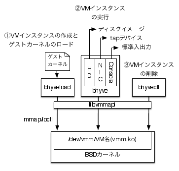

# 第 6 回 Intel VT-xを用いたハイパーバイザの実装
　　　　「仮想CPUの実行処理・その1」

## はじめに

前回までに、5回にわたりハードウェアが提供して
いる仮想化支援機能を解説しました。
今回からは、実際にどのようにして仮想化支援機
構を使い、ハイパーバイザを実装するのかを解説し
ていきます。解説には、実装の具体例として現在
FreeBSDへの実装が進められているハイパーバイザ
「BHyVe (ビーハイブ)」を用います。

## BHyVeとは

BHyVeはNetAppにより開発された、FreeBSDで
動く新しいハイパーバイザです。 2011年に発表され、
実装が進められています。現在、FreeBSD10の新機
能の1つとしてリリースすることを目指していま
す([^1])。設計はLinux KVMに似ており、FreeBSD版の
KVMとも言えるでしょう。ただし、BHyVeは現在開
発の初期段階であるため、現在のKVMに比べ非常
に機能は限られています。現状、実用に用いるのは
難しい開発版の機能となります。しかし、ハイパー
バイザの実装方法を学ぶための教材としては、以下
の二点が優れています。
1つは、最低限の機能のみ実装しているためKVM
と比べるとコード量が非常にコンパクトであること
です。もう1つは、デバイスエミュレーションなど
を行うユーザランドプログラム(詳細は後述)がシン
プルなものであることです。KVMではユーザランド
プログラムに既存のエミュレータであるQEMUを流
用しており、これにより既存OSとの高い互換性が
得られていますがコードの見通しが悪くなっていま
す。そこで、本連載ではKVMではなくBHyVeを用
いて解説を行うことにします。
[^1]) 2013年1月にFreeBSD-CURRENTの開発ツリーにマージされ
　　 ました。

## 解説対象のバージョン

BHyVeは現在、リリース版が存在しません。ま
た、開発の初期段階であるため、大きな変更が加え
られることも予想されます。

### そこで、本連載では現時点でのFreeBSD-

CURRENTでスナップショットが公開されている最
新リビジョンであるr245673を用いて解説を行いま
す。 r245673のインストールディスクは、次のアドレ
スからダウンロードできます。
ftp://ftp.freebsd.org/pub/FreeBSD/snapshots/amd64/amd64/ISO-IMAGES/10.0/FreeBSD-10.0-CURRENT-amd64-20130119-r245673-release.iso
r245673のソースコードは次のコマンドで取得で
きます。
svn co -r245673 svn://svn.freebsd.org/base/head src
また、BHyVe用にコンフィグレーションされたゲ
ストマシンのディスクイメージが配布さ れており、
次のアドレスからダウンロードできます。
http://mirrors.nycbug.org/pub/BHyVe/r244024/diskdev.xz

## BHyVeの動作環境

BHyVeを試すには、Intel VT-xとEPT(Extended
Page Tables)をサポートしたCPUが 必要です。
今のところAMDのCPUには対応していません。
どのモデルのCPUがEPTをサポートしているかは
ark.intel.comで調べられます。簡単な目安としては、
Core i3, i5, i7ならばほぼすべてのCPUが対応して
います。CeleronやPentiumなどの廉価版CPUでも
EPT対応モデルが一部存在しています。実機にイン
ストールするのが最も確実ですが、最近のVMware
(VMware Player・VMware Workstation・VMware
Fusion)ならばNested VM([^2])に対応しているため仮想
マシン上で試すこともできます。
[^2]) ハイパーバイザ上でハイパーバイザを実行可能にする機能。

## BHyVeが提供する機能

現状、BHyVeではゲストOSとしてFreeBSD/
amd64だけをサポートしています。
ハードディスクコントローラとしては、標準的な
IDEやAHCIコントローラのエミュレーションはサ
ポートせず、準仮想化ドライバであるvirtio-blkをサ
ポートしています。
NICコントローラとしても同様に、標準的なIntel
e1000などのデバイスのエミュレーションをサポー
トせず、準仮想化ドライバであるvirtio-netをサポー
トしています。virtioは多くの場合、標準的なデバイ
スのエミュレーションと比較して高い性能が得られ
ますが、ゲストOSにvirtioドライバをインストール
し、/boot/loader.confの設定を行う必要があります。
システムコンソールとしては、標準的なビデオデバ
イスをサポートはサポートされず、PCI接続の16550
互換シリアルポートのみをサポートしています。
PCI接続のシリアルポートをシステムコンソールと
して使うのは非標準的なハードウェア構成であるた
め、これについても/boot/loader.confの設定を行う
必要があります。また、ビデオデバイスをサポート
しないため、X11を起動してGUI環境を表示するこ
とはできません。
BHyVeがエミュレート可能なデバイスは上述の3
種類だけですが、Intel VT-dを用いて実機上のPCI・
PCI Expressデバイスをゲストマシンへパススルー
接続できます。この他、割り込みコントローラのエ
ミュレーション(Local APIC、IO-APIC)や、タイマ
デバイスのエミュレーション、ハードウェア構成を
ゲストOSへ伝えるのに必要なAPICなどをサポー
トしています。また、BIOSやUEFIなどのファーム
ウェアをサポートしていないため、ディスクイメー
ジからブートローダをロードしてゲストOSを起動
することができません。このためにハイパーバイザ
の機能としてFreeBSDカーネルをロードしゲストマ
シンを初期化するOSローダが実装されています。

## BHyVeの構成

BHyVeは、カーネルモジュールとユーザランドプ
ラグラムの2つから構成されます。
カーネルモジュールvmm.koは、CPUに対して
VT-x命令を発効するなど、ハードウェアに近い処理
を行います。
ユーザランドプログラム/usr/sbin/bhyveは、ユー
ザインタフェースを提供し、ハードウェアエミュ
レーションを行います。
また、BHyVeには/usr/sbin/bhyveloadというツー
ルがあります。前章で述べた通り、BHyVeではディ
スクイメージ上のブートローダを実行できません。
このため、ゲストカーネルをロードして起動可能な
状態に初期化するゲストOSローダ(/usr/sbin/bhyveload)
が付属します。
/usr/sbin/bhyveloadはFreeBSDブートローダを
FreeBSD上で実行可能なプログラムに改変し、ゲ
ストマシンのディスクイメージからカーネルを読み
込んでゲストメモリ空間へ展開するようにしたもの
です。/usr/sbin/bhyveloadを実行すると、FreeBSD
のブート時に表示されるのと同じメニューが表示さ
れます。このため、一見するとゲストマシンの実行
が開始されたように見えます。しかし、これはホス
トOSで/usr/sbin/bhyveloadが出力している画面で、
ゲストマシンの起動は開始されていません。
このほか、ゲストマシンの実行とは直接関係しま
せんが、VMインスタンスの削除などを行うための
VMインスタンス管理ツールとして/usr/sbin/bhyvectl
が提供されています。
これらのユーザランドのプログラム群は、VM管理
用のライブラリ(libvmmapi)を通してゲストマシンの
初期化や実行をします。libvmmapiはmmapやioctlを
発行し、vmm.koが提供するデバイスを操作します。
 全体図を図[fig1]に示します。




## BHyVeの使い方

BHyVeを試すには、ホストマシンのセットアップ
とゲストマシンのディスクイメージの準備が必要で
す。前述のアドレスを参照してください。
リスト1にシェルからBHyVeを用いてゲストマシ
ンを実行する方法を示します。

### リスト 1 BHyVe 実行イメージ
```
 使い方はKVMに似ていますが、VMインスタン
スの状態がVM実行プログラムと分離されてお
り、/dev/vmm/VM名に保持される点がKVMと異
なっています。このため、OSローダがVM実行プ
ログラムと別プログラムになっていたり、VM実
行プログラムを終了とは別にVMインスタンス
の削除コマンドを実行する必要が出てきます。
```


## まとめ

今回は、BHyVeの概要と使い方について説明しま
した。次回からいよいよソースコードの解説に移り
たいと思います。
ライセンス
==========

Copyright (c) 2014 Takuya ASADA. 全ての原稿データ は
クリエイティブ・コモンズ 表示 - 継承 4.0 国際
ライセンスの下に提供されています。
