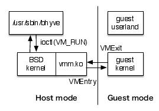

# 第7回 Intel VT-x を用いたハイパーバイザの実装その2
　　　「/usr/sbin/bhyve による仮想 CPU の実行処理」

## はじめに

前回は、BHyVeの概要や使い方について紹介して
きました。いよいよソースコードの解説に入ってい
きます。今回は、とくに/usr/sbin/bhyveの初期化と
VMインスタンスの実行機能の実装について解説を
していきます。

## 解説対象のバージョン

BHyVeは、現在開発の初期段階です。日々開発が
進められており、さまざまな機能が追加されていま
すが、リリースバージョンが存在していません。
そこで、本連載では執筆時点での最新リビジョン
であるr245673を用いて解説を行います。r245673
のインストールディスクは、以下のアドレスからダ
ウンロードできます。
ftp://ftp.freebsd.org/pub/FreeBSD/snapshots/amd64/amd64/ISO-IMAGES/10.0/FreeBSD-10.0-CURRENT-amd64-20130119-r245673-release.iso
r245673のソースコードは次のコマンドで取得で
きます。
svn co -r245673 svn://svn.freebsd.org/base/head src

## /usr/sbin/bhyveと/usr/sbin/bhyveloadの役割分担

まずはじめに、前回簡単に紹介した/usr/sbin/
bhyveと/usr/sbin/bhyveloadの役割分担について解
説します。ゲストOSを起動するには、/usr/sbin/
bhyveを実行する前に/usr/sbin/bhyveloadを実行し
てゲストカーネルのロードを行います。/usr/sbin/
bhyveloadを実行すると、/dev/vmm/へVMインスタ
ンスのデバイスファイルが作成されます。このデバ
イスファイルを通じてゲストメモリ領域にゲスト
カーネルがロードされ、ゲストマシンのレジスタ初
期値やGDT・IDTなどのデスクリプタの設定が行わ
れます。
これに対して/usr/sbin/bhyveの仕事は、初期化済
みのVMインスタンスのデバイスファイルをオープ
ンし、VMインスタンスの実行を開始するすることに
なります。また、ゲストOSが使用する各種デバイ
スをエミュレーションするのも/usr/sbin/bhyveの役
割となります。
なお、CPUのモードをVMX non root modeに切り
替えるなどのハードウェアに近い処理は、特権モー
ドで実行する必要があるためカーネルモジュール
(vmm.ko)の仕事になります。
/usr/sbin/bhyveが起動されたら、まずはじめにゲ
ストマシンが使用する各種デバイス(HDD/NIC/
コンソール)のエミュレータを使用可能な状態に初期
化する必要があります。
初期化が終わると、 /usr/sbin/bhyveは仮想CPUの
数だけスレッドを起動し、/dev/vmm/${name}に対し
てVM_RUN ioctlを発行します(図[fig1])。vmm.koはioctl
を受けてCPUをVT-x non root modeへ切り替えゲ
ストOSを実行します(VMEntry)。



VMX non root modeでハイパーバイザの介入が必
要な何らかのイベントが発生すると制御がvmm.koへ
戻され、イベントがトラップされます(VMExit)。
イベントの種類が/usr/sbin/bhyveでハンドルされ
る必要のあるものだった場合、ioctlはリターンされ、
制御が/usr/sbin/bhyveへ移ります。イベントの種類
が/usr/sbin/bhyveでハンドルされる必要のないもの
だった場合、ioctlはリターンされないままゲスト
CPUの実行が再開されます。
それでは、実際にBHyVeのソースコードを読んで
いきましょう。リスト1とリスト2にソースコードを
示します。

### リスト 1 usr.sbin/bhyve/bhyverun.c
```
▼リスト 2 lib/libvmmapi/vmmapi.c
```


## まとめ

/usr/sbin/bhyveの初期化とVMインスタンスの実
行機能の実装について、ソースコードを解説しまし
た。極めてシンプルなループによりVMインスタン
スの実行処理が実現されていることを確認して頂け
たかと思います。
今回はユーザランド側の実装のみ解説しましたが、
次回はこれに対応するカーネル側の実装を見て行き
たいと思います。
ライセンス
==========

Copyright (c) 2014 Takuya ASADA. 全ての原稿データ は
クリエイティブ・コモンズ 表示 - 継承 4.0 国際
ライセンスの下に提供されています。
