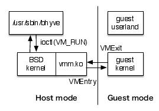

# 第8回 Intel VT-xを用いたハイパーバイザの実装その3

##    「vmm.ko による VMEntry」

## はじめに

前回は、/usr/sbin/bhyveの初期化とVMインスタ
ンスの実行機能の実装について解説しました。今
回はvmm.koがVM_RUN ioctlを受け取ってから
VMEntryするまでの処理を解説します。

## 解説対象のソースコードについて

本連載では、FreeBSD-CURRENTに実装されてい
るBHyVeのソースコードを解説しています。この
ソースコードは、FreeBSDのSubversionリポジトリ
から取得できます。リビジョンはr245673を用いて
います。
お手持ちのPCにSubversionをインストールし、次
のようなコマンドでソースコードを取得してください。
svn co -r245673 svn://svn.freebsd.org/base/head src

## /usr/sbin/bhyveによる仮想CPUの実行処理の復習

/usr/sbin/bhyveは仮想CPUの数だけスレッドを
起動し、それぞれのスレッドが/dev/vmm/${name}に
対してVM_RUN ioctlを発行します(図[fig1])。vmm.koは
ioctlを受けてCPUをVMX non root modeへ切り替
えゲストOSを実行します(VMEntry)。

VMX non root modeでハイパーバイザの介入が必
要な何らかのイベントが発生すると制御がvmm.koへ
戻され、イベントがトラップされます(VMExit)。
イベントの種類が/usr/sbin/bhyveでハンドルされ
る必要のあるものだった場合、ioctlはリターンされ、
制御が/usr/sbin/bhyveへ移ります。イベントの種類
が/usr/sbin/bhyveでハンドルされる必要のないもの
だった場合、ioctlはリターンされないままゲスト
CPUの実行が再開されます。今回の記事では、vmm.
koにVM_RUN ioctlが届いてからVMX non root
modeへVMEntryするまでを見ていきます。

### vmm.koがVM_RUN ioctlを

### 受け取ってからVMEntryするまで

vmm.koがVM_RUN ioctlを受け取ってから
VMEntryするまでの処理について、順を追って見て
いきます。リスト1、リスト2、リスト3、リスト4
にソースコードを示します。白丸の数字と黒丸の数
字がありますが、ここでは白丸の数字を追って見て
いきます。
VMExit時の再開アドレス
(19)でCPUはVMX non-root modeへ切り替わりゲ
ストOSが実行されますが、ここからVMExitした時
にCPUはどこからホストOSの実行を再開するので
しょうか。直感的にはvmlaunchの次の命令ではない
かと思いますが、そうではありません。VT-xでは、
VMEntry時にVMCSのGUEST_RIPからVMX non-
root modeの実行を開始し、VMExit時にVMCSの
HOST_RIPからVMX root modeの実行を開始する
ことになっています。 GUEST_RIPはVMExit時に保
存されますが、 HOST_RIPはVMEntry時に保存され
ません。
このため、VMCSの初期化時に指定されたHOST_
RIPが常にVMExit時の再開アドレスとなります。
では、VMCSのHOST_RIPがどのように初期化され
ているか、順を追って見ていきます。リスト1、リ
スト2、リスト3、リスト4にソースコードを示しま
す。今度は黒丸の数字を追って見ていきます。
・リスト1の解説
vmm_dev.cは、sysctlによる/dev/vmm/${name}の作
成・削除と/dev/vmm/${name}に対するopen(), close(),
read(), write(), mmap(), ioctl()のハンドラを定義して
います。ここでは/dev/vmm/${name}の作成とVM_
RUN ioctlについてのみ見ていきます。
・リスト2の解説
vmm.cは、Intel VT-xとAMD-Vの2つの異なる
ハードウェア仮想化支援機能のラッパー関数を提供
しています(このリビジョンではラッパーのみが実装
されており、AMD-Vの実装は行われていません)。
Intel/AMD両アーキテクチャ向けの各関数はvmm_
ops構造体で抽象化され、207〜210行目のコード
CPUを判定してどちらのアーキテクチャの関数群を
使用するかを決定しています。
・リスト3の解説
intel/ディレクトリにはIntel VT-xに依存したコー
ド群が置かれています。vmx.cはその中心的なコード
で、vmm.cで登場したvmm_ops_intelもここで定義さ
れています。
・リスト4の解説
vmcs.cはVMCSの設定に関するコードを提供して
います。ここではHOST_RIPの書き込みに注目して
います。なお、vmwriteを行う前にvmptrld命令を発
行していますが、これはCPUへVMCSポインタを
セットしてVMCSへアクセス可能にするためです。
同様に、vmwriteを行った後にvmclear命令を発行し
ていますが、これは変更されたVMCSをメモリへラ
イトバックさせるためです。
・リスト5の解説
vmx_support.SはC言語で記述できない、コンテ
キストの退避/復帰やVT-x拡張命令の発行などの
コードを提供しています。ここでは、ホストレジス
タの退避(vmx_setjmp)とVMEntry(vmx_launch)の処
理について見ています。

## まとめ

vmm.koがVM_RUN ioctlを受け取ってから
VMEntryするまでにどのような処理が行われている
かについて、ソースコードを解説しました。次回は
これに対応するVMExitの処理について見ていきま
す。
ライセンス
==========

Copyright (c) 2014 Takuya ASADA. 全ての原稿データ は
クリエイティブ・コモンズ 表示 - 継承 4.0 国際
ライセンスの下に提供されています。
