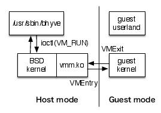

# 第9回 Intel VT-xを用いたハイパーバイザの実装

##    その5「vmm.koへのVMExit」


## はじめに

前回は、vmm.koがVM_RUN ioctlを受け取ってか
らVMEntryするまでの処理を解説しました。今回は
VMX non root modeからvmm.koへVMExitしてきた
ときの処理を解説します。

## 解説対象のソースコードについて

本連載では、FreeBSD-CURRENTに実装されてい
るBHyVeのソースコードを解説しています。
このソースコードは、FreeBSDのSubversionリポジ
トリから取得できます。リビジョンはr245673を用
いています。お手持ちのPCにSubversionをインス
トールし、次のようなコマンドでソースコードを取
得してください。
svn co -r245673 svn://svn.freebsd.org/base/head src

## /usr/sbin/bhyveによる仮想CPUの実行処理のおさらい

/usr/sbin/bhyveは仮想CPUの数だけスレッドを
起動し、それぞれのスレッドが/dev/vmm/${name}に
対してVM_RUN ioctlを発行します(図[fig1])。vmm.koは
ioctlを受けてCPUをVMX non root modeへ切り替
えゲストOSを実行します(これがVMEntryです)。



VMX non root modeでハイパーバイザの介入が必
要な何らかのイベントが発生すると制御がvmm.koへ
戻され、イベントがトラップされます(これが
VMExitです)。
イベントの種類が/usr/sbin/bhyveでハンドルされ
る必要のあるものだった場合、ioctlはリターンされ、
制御が/usr/sbin/bhyveへ移ります。イベントの種類
が/usr/sbin/bhyveでハンドルされる必要のないもの
だった場合、ioctlはリターンされないままゲスト
CPUの実行が再開されます。
今回は、VMX non root modeからvmm.koへVMExit
してきたときの処理を見ていきます。

## vmm.koがVM_RUN ioctlを受け取ってからVMEntryするまで


vmm.koがVM_RUN ioctlを受け取ってからVMEntry
するまでの処理について、順を追って見ていきます。
今回は、I/O命令でVMExitしたと仮定します。
前回解説のとおり、 VMExit時のVMX root modeの
再開アドレス(RIP [^1])はVMCSのHOST_RIPで指定
されたvmx_longjmpに設定されています。vmx_
longjmpはvmx_setjmpと対になっている関数で、
POSIX APIのsetjmp/longjmpに近い動作を行いま
す。つまり、vmx_longjmpはvmx_setjmpが呼ばれた直
後のアドレスへジャンプします。結果として、
VMExitされるとvmx_longjmpを経由しvmx_runの
whileループへ戻ってくることになります。
また、vmx_setjmpはどこからreturnしてきたかを
示すために戻り値を用いています。ここではvmx_
longjmpから戻ってきたことを表すVMX_RETURN_
LONGJMPを返します。
では、以上のことをふまえてソースコードの詳細
を見ていきましょう。リスト1、リスト2、リスト3
に示します。解説キャプションの番号は、注目すべ
き処理の順番を示します。

[^1]: すでに前回までの記事でも「RIP」と表記していますが、なんのことだろうと思った方もいらっしゃるかもしれません。これは、x86_64アーキテクチャでの64bit幅のEIPレジスタ(インストラクションポインタ)の名前です。ほかにもEAX、EBXレジスタがRAX、RBXのような名前になっています。

### sys/amd64/vmm/intel/vmx.c

intel/ディレクトリにはIntel VT-xに依存したコー
ド群が置かれています。今回はゲストマシン実行
ループの中心となるvmx_runと、VMExitのハンドラ
関数であるvmx_exit_processを解説します。

### リスト 1   sys/amd64/vmm/intel/vmx.c
```

  sys/amd64/vmm/intel/vmx_support.S
```

vmx_support.SはC言語で記述できない、コンテ
キストの退避/復帰やVT-x拡張命令の発行などの
コードを提供しています。今回は、vmx_setjmp・vmx_
longjmpを解説します。

### リスト 2   sys/amd64/vmm/intel/vmx_support.S
```

  sys/amd64/vmm/vmm.c
```

vmm.cは、Intel VT-xとAMD-Vの2つの異なる
ハードウェア仮想化支援機能のラッパー関数を提供
しています。今回はvmx_runのラッパー関数のvm_
runを解説します。

### リスト 3   sys/amd64/vmm/vmm.c
```

```


## まとめ

VMX non root modeからvmm.koへVMExitしてき
たときの処理について、ソースコードを解説しまし
た。次回は、I/O命令によるVMExitを受けて行われ
るユーザランドでのエミュレーション処理について
見ていきます。
ライセンス
==========

Copyright (c) 2014 Takuya ASADA. 全ての原稿データ は
クリエイティブ・コモンズ 表示 - 継承 4.0 国際
ライセンスの下に提供されています。
